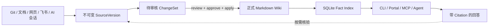
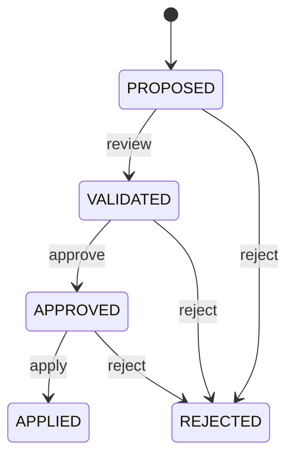
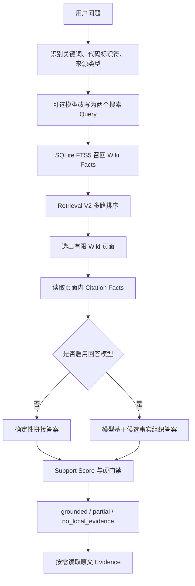
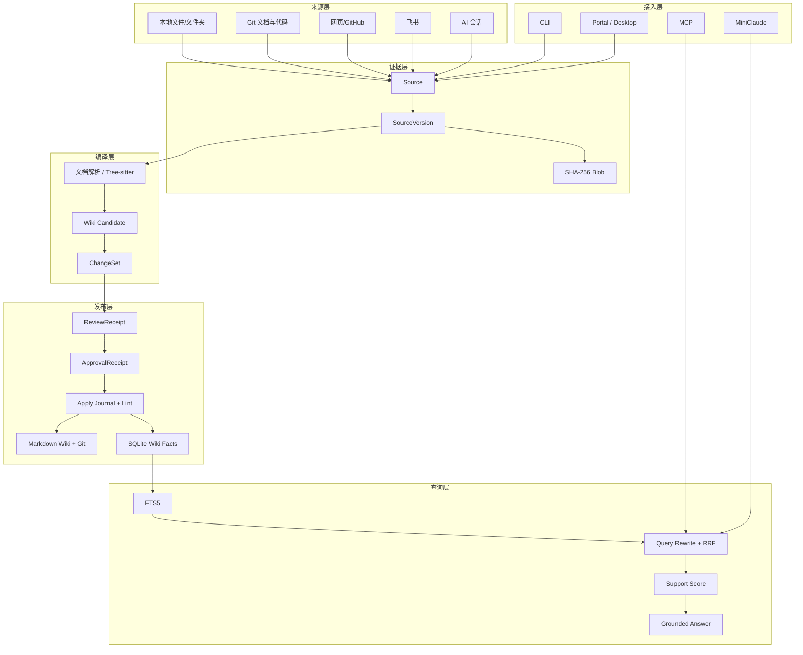

# MemoryForge 项目源码深度解读

> 适用代码版本：`f0d7ae3`（2026-08-17）  
> 目标：让项目作者能够真正理解系统、独立演示，并经得住面试追问。

## 0. 先记住一句话

MemoryForge 不是“把文档切片后直接问大模型”的聊天工具，而是一条本地知识生产流水线：

```text
原始资料
  -> 保存不可变版本
  -> 编译成 Wiki 草稿
  -> 人工审核并批准
  -> 写入正式 Wiki 和 Git
  -> 检索少量事实
  -> 有证据才回答
```

最核心的价值不是“能回答问题”，而是：

1. 知识更新经过审核；
2. 每条结论能回到原文；
3. 来源更新后可以识别旧知识；
4. 证据不足时拒绝把猜测包装成项目事实；
5. 全部核心数据可留在本机。

可以把它理解成一家“技术资料出版社”：

| MemoryForge 概念 | 大白话比喻 |
| --- | --- |
| Source Adapter | 收件员，接收 Git、文件、网页、飞书和 AI 会话 |
| Blob / SourceVersion | 原稿档案库，保存每一版原文 |
| Compiler | 编辑部，把原稿整理成可阅读页面 |
| ChangeSet | 待审校样，不是正式知识 |
| review / approve / apply | 看稿、签字、正式出版 |
| Markdown Wiki | 已出版的知识 |
| Git Commit | 每次出版的版本记录 |
| SQLite FTS5 | 图书馆检索目录 |
| Citation | 书中脚注，指向某版原稿的具体字符区间 |
| Support Score | 出版前的证据质检员 |
| MCP Server | 给 Codex、Claude Code、Gemini 使用的借阅窗口 |

---

## 1. 项目解决什么问题

### 1.1 普通做法的问题

给 AI 编程助手补充项目知识，常见做法有两种。

第一种是把 README、设计文档和代码全部塞进上下文。问题是：

- 上下文很快膨胀；
- 每次提问重复发送相同内容；
- 新旧文档混在一起；
- 模型很难判断哪段内容仍然有效；
- 回答生成后不容易说明依据。

第二种是普通 RAG：

```text
原文 -> 切片 -> 向量化或全文索引 -> 召回片段 -> 大模型回答
```

它解决了“不能每次发送全部文档”的问题，但通常没有重点解决：

- 新索引内容是否经过人审核；
- 某条知识来自哪个版本；
- 来源变化后旧答案是否失效；
- 一次回答能否回放到当时的原文；
- 模型是否越过本地资料的隐私边界。

### 1.2 MemoryForge 的核心思路

MemoryForge 在原始资料和问答之间增加了一层稳定 Wiki：



这里的“编译”与编译器思路相似：

- 原始文档是源代码；
- Wiki 页面是编译产物；
- ChangeSet 是待审核构建结果；
- Lint 是静态检查；
- Git Commit 是发布版本；
- SQLite 表是可重建的查询投影。

因此，正式知识不是模型临时生成的一段回答，而是经过版本管理和审核的中间层。

---

## 2. 技术栈分别负责什么

项目依赖不多，每个依赖职责清楚。

| 技术 | 项目中的职责 |
| --- | --- |
| Python 3.11 | 主语言；业务逻辑、文件处理、HTTP 服务和发布脚本 |
| Pydantic | 校验模型输出、ChangeSet、Citation、Code Symbol 等结构 |
| Typer | 提供 `memoryforge` 命令行 |
| SQLite | 保存来源、版本、页面归属、事实索引、策略和审计记录 |
| SQLite FTS5 | 对来源和 Wiki Fact 做全文检索 |
| Tree-sitter | 把 Python、Go、TypeScript/TSX 代码解析成语法树 |
| MCP Python SDK | 向 Codex、Claude Code、Gemini 暴露标准工具 |
| PyWebView | 用原生窗口承载本地 Portal，形成桌面端 |
| Git | 管理正式 Wiki 的版本、历史和回滚 |
| `http.server` | 实现只绑定本机的 Portal HTTP 服务 |

需要分清“依赖提供了什么”和“项目自己实现了什么”：

- Tree-sitter 只负责生成语法树；符号抽取、关系识别、稳定 ID、模块规划和 Wiki 渲染由项目实现。
- FTS5 只负责倒排索引和 BM25 排序；查询改写、候选融合、来源选择和 Support Score 由项目实现。
- MCP SDK 只负责协议；工具权限、仓库作用域、证据读取和返回合同由项目实现。
- PyWebView 只提供窗口；页面、API、后台任务和审核流程由项目实现。
- Pydantic 只执行声明式校验；什么字段可信、什么状态允许流转由项目定义。

---

## 3. 代码目录怎么分工

```text
src/memoryforge/
├── core/                 # 核心数据合同和跨模块基础类型
├── storage/              # Workspace、SQLite、Blob、ChangeSet、Git 版本
├── adapters/             # 文件、Git、网页、飞书、GitHub、AI 会话接入
├── compiler/             # 来源到 Wiki、审核发布、Lint、冲突和新鲜度
├── code/                 # Tree-sitter 代码索引、关系、影响分析
├── query/                # 检索、排序、Support Score、问答和会话
├── interface/            # CLI、MCP Server、客户端连接
├── portal/               # 本地 Web Portal、桌面壳和后台任务
├── automation/           # 自动更新的风险分类和策略决策
├── evaluation/           # 评测指标计算
└── client_integrations/  # Codex、Claude、Gemini 接入计划
```

### 3.1 `core`

关键文件：

- [`core/models.py`](../src/memoryforge/core/models.py)
- [`core/retrieval_models.py`](../src/memoryforge/core/retrieval_models.py)
- [`core/egress_models.py`](../src/memoryforge/core/egress_models.py)

这里定义系统“名词”：

- `LocalDocument`
- `SourceVersionManifest`
- `PageChange`
- `Citation`
- `ChangeSet`
- `ReviewReceipt`
- `ApprovalReceipt`
- `CodeSymbol`
- `RetrievalCandidate`

这些对象多数使用：

```python
model_config = ConfigDict(extra="forbid", frozen=True)
```

含义：

- `extra="forbid"`：多出未知字段就拒绝，防止模型输出拼错字段后被静默忽略；
- `frozen=True`：对象创建后不可修改，减少生命周期中被偷偷改写的可能。

### 3.2 `storage`

关键文件：

- [`storage/workspace.py`](../src/memoryforge/storage/workspace.py)
- [`storage/workspace_contract.py`](../src/memoryforge/storage/workspace_contract.py)
- [`storage/blob_store.py`](../src/memoryforge/storage/blob_store.py)
- [`storage/changesets.py`](../src/memoryforge/storage/changesets.py)
- [`storage/version_store.py`](../src/memoryforge/storage/version_store.py)
- [`storage/apply_journal.py`](../src/memoryforge/storage/apply_journal.py)

职责：

- 初始化和打开 Workspace；
- 保存来源及其历史版本；
- 管理 SQLite 查询投影；
- 保存不可变 ChangeSet；
- 管理正式 Wiki 的 Git Commit；
- 在发布中断后恢复一致状态。

### 3.3 `adapters`

每个 Adapter 只负责：

1. 读取一种外部来源；
2. 做必要安全检查；
3. 转成统一的 `LocalDocument`；
4. 调用同一条存储链路。

它不直接写 Wiki。

主要 Adapter：

| 文件 | 来源 |
| --- | --- |
| [`adapters/importer.py`](../src/memoryforge/adapters/importer.py) | 本地 Markdown/TXT |
| [`adapters/folder_adapter.py`](../src/memoryforge/adapters/folder_adapter.py) | 递归文件夹 |
| [`adapters/git_adapter.py`](../src/memoryforge/adapters/git_adapter.py) | 本地 Git Commit 中的文档和代码 |
| [`adapters/web_adapter.py`](../src/memoryforge/adapters/web_adapter.py) | 公开网页或本地 HTML |
| [`adapters/feishu_adapter.py`](../src/memoryforge/adapters/feishu_adapter.py) | 飞书 Docx/Wiki |
| [`adapters/github_thread_adapter.py`](../src/memoryforge/adapters/github_thread_adapter.py) | GitHub Issue/PR |
| [`adapters/codex_adapter.py`](../src/memoryforge/adapters/codex_adapter.py) | Codex 会话 |

### 3.4 `compiler`

关键文件：

- [`compiler/compiler.py`](../src/memoryforge/compiler/compiler.py)
- [`compiler/source_rendering.py`](../src/memoryforge/compiler/source_rendering.py)
- [`compiler/code_wiki_compiler.py`](../src/memoryforge/compiler/code_wiki_compiler.py)
- [`compiler/lifecycle.py`](../src/memoryforge/compiler/lifecycle.py)
- [`compiler/wiki_facts.py`](../src/memoryforge/compiler/wiki_facts.py)
- [`compiler/linting.py`](../src/memoryforge/compiler/linting.py)

职责：

- 找出尚未发布的新来源版本；
- 把来源整理为候选 Wiki 页面；
- 生成 `INDEX.md`；
- 校验 Citation 是否真能回到原文；
- 把草稿包装成 ChangeSet；
- 完成 review、approve、apply 和 reject；
- 把正式页面解析成可检索的 Wiki Fact。

### 3.5 `query`

关键文件：

- [`query/query.py`](../src/memoryforge/query/query.py)
- [`query/retrieval_v2.py`](../src/memoryforge/query/retrieval_v2.py)
- [`query/support.py`](../src/memoryforge/query/support.py)
- [`query/provider.py`](../src/memoryforge/query/provider.py)
- [`query/agent.py`](../src/memoryforge/query/agent.py)
- [`query/agent_access.py`](../src/memoryforge/query/agent_access.py)

职责：

- 从问题中识别关键词、代码标识符和来源意图；
- 召回 Wiki 页面和事实；
- 对多路候选做融合和重排；
- 判断证据是否足以回答；
- 可选调用模型组织语言；
- 给 MCP 和 Agent 提供稳定业务接口。

### 3.6 `interface` 与 `portal`

`interface` 是协议入口：

- CLI；
- MCP Server；
- Codex/Claude/Gemini 连接。

`portal` 是交互入口：

- 本地 HTTP API；
- 页面浏览与搜索；
- 来源导入和后台任务；
- ChangeSet Diff、批准、应用和拒绝；
- 桌面窗口。

业务逻辑没有复制到界面层。CLI、Portal 和 MCP 最终复用 compiler、query、storage 中的函数。

---

## 4. 六个核心数据对象

### 4.1 Source：逻辑来源

Source 表示“这是哪份资料”，不是“资料现在是什么内容”。

例如同一个 `docs/cache.md` 更新十次：

- `source_id` 不变；
- 会产生十个 `SourceVersion`；
- 每个版本指向自己的 Blob。

本地文件的 `source_id` 大致由下面内容计算：

```text
SHA256("local:" + 来源根目录身份 + ":" + 相对路径)
```

Git 来源则使用规范化仓库身份和相对路径，避免把用户名、凭证和 URL 查询参数放进身份。

### 4.2 Blob：按内容寻址的原文

Blob 文件名来自内容 SHA-256：

```text
raw/blobs/<哈希前两位>/<完整 SHA-256>.blob
```

相同内容只需保存一份。读取时重新计算哈希，内容被修改就拒绝使用。

这叫 content-addressed storage，类似 Git Object：

```text
内容决定地址
地址反过来验证内容
```

### 4.3 SourceVersion：来源的某一版

`source_versions` 表保存：

- 对应 Source；
- 对应 Blob；
- 上一版本；
- 标题、类型、时间、标签；
- `public` 或 `local_only`；
- 是否为当前版本。

同一个 Source 只有一个 `is_current = 1` 的版本，由 SQLite 唯一索引保证。

### 4.4 Wiki Page：给人阅读的知识页

Wiki 页面位于 `wiki/pages/`，带统一 Frontmatter：

```yaml
---
title: "Cache Key Design"
type: concept
summary: "缓存键由命名空间、对象 ID 和版本组成"
tags: ["design", "cache"]
sources: ["<source_id>"]
source_version: 12
---
```

页面类型只有三类：

- `entity`：它是什么；
- `concept`：它如何工作；
- `synthesis`：为什么这样设计、如何取舍。

### 4.5 Wiki Fact 与 Citation

Wiki 中的可回答事实带脚注：

```markdown
- 缓存键包含业务命名空间和对象 ID。[^source-1]

[^source-1]: source `<source_id>` · revision `12` · `chars:120-168`
```

Citation 的关键字段：

| 字段 | 含义 |
| --- | --- |
| `source_id` | 哪个逻辑来源 |
| `source_version` | 来源的哪一版 |
| `locator` | 原文字符区间 |
| `quote` | Wiki 中展示的事实 |
| `quote_sha256` | 引文自身的摘要，部分底层对象使用 |

`compiler/wiki_facts.py` 会把页面中的事实解析成 `wiki_facts` 行。每条事实都有稳定
`fact_id`，用于 FTS 检索和回放。

### 4.6 ChangeSet：待审核知识变更

ChangeSet 记录：

- 基于哪个 Workspace Git Commit 生成；
- 使用了哪些 Source；
- 每个 Source 的版本；
- 要创建、更新或归档哪些页面；
- 变更来源是确定性编译、LLM 编译还是 Agent 提案；
- 候选页面内容。

ChangeSet 创建后保持不可变。review 和 approve 不去修改原 JSON，而是分别追加：

- `review.json`
- `review.sha256`
- `approval.json`
- `approval.sha256`

Approval 还绑定 Review 的 SHA-256。这样不能在“看完 A 草稿”后偷偷替换成 B 草稿继续发布。

---

## 5. Workspace 内部结构

执行：

```bash
memoryforge init ./my-wiki
```

会创建：

```text
my-wiki/
├── raw/
│   └── blobs/                    # 不可变原文
├── wiki/
│   ├── INDEX.md                  # 页面目录
│   └── pages/                    # 正式 Wiki 页面
├── .memoryforge/
│   ├── index.sqlite              # 查询投影和元数据
│   ├── manifests/sources/        # SourceVersion 清单
│   ├── staging/                  # 待审核 ChangeSet
│   ├── rejected/                 # 拒绝记录
│   ├── sessions/                 # 有上限的会话状态
│   ├── traces/                   # 本地追踪数据
│   ├── config.yaml
│   └── schema.yaml
├── AGENTS.md                     # Workspace 使用约束
├── .memoryforgeignore
├── .gitignore
└── .git/                         # 正式 Wiki 版本历史
```

关键分工：

- `raw/` 是事实原件；
- `wiki/` 是审核后的知识；
- SQLite 是查询加速和状态投影；
- Git 是正式 Wiki 的版本真相；
- `staging/` 是尚未发布的候选区。

SQLite 不是唯一真相。应用中断后，`wiki/` 与 Git 可以重新构建查询投影。

---

## 6. 主流程一：初始化 Workspace

入口：

- CLI：`interface/cli.py::init`
- 核心：`storage/workspace.py::Workspace.initialize`

执行过程：

1. 把目标路径转成绝对路径；
2. 拒绝危险符号链接；
3. 拒绝覆盖已有的 `raw/`、`wiki/`、`.memoryforge/` 或 `.git/`；
4. 创建私有目录并设置权限；
5. 写入默认配置、Schema、AGENTS 和 Git Ignore；
6. 创建 SQLite 表和 FTS5 索引；
7. 初始化 Git；
8. 创建第一条 baseline commit。

为什么初始化就建 Git：

后续每个 ChangeSet 都记录 `base_commit`。没有稳定基线，系统无法判断草稿生成后正式 Wiki
是否被别人改过。

---

## 7. 主流程二：导入一份资料

以本地文档为例：

```bash
memoryforge import /path/to/design.md --workspace ./my-wiki
```

调用链：

```text
CLI import
  -> adapters.importer.import_local_file
  -> 路径、后缀、大小、编码、密钥检查
  -> 生成 LocalDocument
  -> storage.workspace.store_source
  -> 写入 Blob
  -> 写入 SourceVersion
  -> 更新 source_fts
  -> 写 SourceVersionManifest
```

### 7.1 Adapter 做什么

Adapter 把各种来源统一成：

```python
LocalDocument(
    source_uri=...,
    source_path=...,
    media_type=...,
    category=...,
    title=...,
    content=...,
    sensitivity=...,
    tags=...,
)
```

因此后面的编译器不需要知道资料来自飞书还是 Git。

这是典型的 Adapter Pattern：

```text
多种外部格式 -> 统一内部对象 -> 一套核心流程
```

### 7.2 导入阶段的安全检查

`adapters/importer.py` 会检查：

- 文件必须位于允许的根目录内；
- 不接受符号链接；
- 只允许声明的文本后缀；
- 单文件不超过 5 MiB；
- 必须是 UTF-8；
- 遵守 `.memoryforgeignore`；
- 拒绝私钥、常见 Token 和高置信度 Secret。

网页导入还会：

- 只允许 HTTP/HTTPS；
- 禁止 URL 中携带用户名和密码；
- DNS 解析结果必须全部是公网地址；
- 请求固定到已经校验的 IP，降低 DNS Rebinding 风险；
- 限制跳转次数和响应大小。

### 7.3 为什么导入后还不能查询

导入只代表：

> 系统收到了一版新原稿。

它不代表：

> 这版原稿已经成为正式知识。

`source_versions.is_current` 表示最新导入版本；
`applied_source_versions` 表示正式 Wiki 当前使用的版本。

两个表分开，使系统可以表达：

```text
原始资料已经更新，但 Wiki 尚未审核更新。
```

这也是“新鲜度”判断的基础。

---

## 8. 主流程三：把来源编译成 Wiki 草稿

入口：

```bash
memoryforge ingest --pending --workspace ./my-wiki
```

核心函数：

```text
compiler.compiler.compile_pending_sources
```

### 8.1 找出待编译来源

系统查询当前 SourceVersion，并与 `applied_source_versions` 对比：

```text
当前版本 != 已应用版本
```

满足条件的来源才进入编译。

因此“增量更新”的本质不是猜测文件哪里变了，而是比较稳定版本 ID。

### 8.2 确定性编译

未启用模型时，调用 `_compile_deterministically`：

1. Markdown 被拆成标题、段落、列表、表格和代码块；
2. 每个事实保存原文起止字符；
3. 生成带 Frontmatter 和脚注的 Wiki 页面；
4. 更新 `INDEX.md`；
5. 计算稳定 `changeset_id`；
6. 输出 `Compilation`，但不写正式 Wiki。

“确定性”表示相同输入和相同 Git 基线应产生相同结果。

### 8.3 LLM 编译

启用 Provider 时，流程分两步：

```text
先规划 CompilationPlan
再生成 PageChange
```

模型可以提出：

- 页面标题；
- 页面类型；
- 摘要；
- 正文；
- 来源组合；
- Citation 字符区间。

模型不能直接控制：

- `INDEX.md`；
- 正式 Wiki 文件写入；
- Git Commit；
- review/approve/apply；
- 任意文件路径；
- 未提供的 Source；
- 页面已有来源归属。

模型输出后，`_validate_llm_changes` 会检查：

- 路径必须位于 `wiki/pages/`；
- 每个待处理来源必须恰好出现一次；
- 不能引用未提供来源；
- Citation 不能越界；
- Citation 不能只指向标题；
- Citation 需要在句子边界结束；
- 更新旧页面时不能偷换页面所有权；
- AI 会话结论必须引用 Assistant 内容，不能把用户问题当结论。

因此正确说法是：

> LLM 负责提议内容，程序负责限制范围和验证证据。

不能说：

> LLM 自动理解所有资料并直接维护知识库。

### 8.4 Candidate 为什么不直接写 Wiki

`ChangeSetStore.create` 把候选文件写入 `.memoryforge/staging/<changeset_id>/`。

发布前会校验：

- `base_commit` 仍等于当前 Workspace Commit；
- Source 和 Citation 存在；
- 元数据 SHA-256 正确；
- 相同 ChangeSet ID 的重复请求必须内容一致；
- 候选路径不能越界。

这相当于先生成一份不可变“安装包”，审核通过后才能安装。

---

## 9. 主流程四：review、approve、apply



代码里的持久化实现更严格：

- 原始 `changeset.json` 始终保持 `PROPOSED`；
- review 追加独立 Receipt；
- approve 再追加独立 Receipt；
- apply 成功后移动到 `staging/applied/` 并写发布 Receipt。

这样保留了完整审计链，而不是反复覆盖同一个 `status` 字段。

### 9.1 review

`review_changeset`：

1. 读取不可变候选；
2. 从 `base_commit` 读取旧页面；
3. 生成 unified diff；
4. 展示来源、页面数量和告警；
5. 写入绑定 proposal SHA-256 的 ReviewReceipt。

### 9.2 approve

`approve_changeset`：

1. 要求 ReviewReceipt 已存在；
2. 重新校验 ReviewReceipt；
3. 写 ApprovalReceipt；
4. ApprovalReceipt 绑定 proposal SHA-256 和 review SHA-256。

`approve` 不修改正式 Wiki。

### 9.3 apply

`apply_changeset` 是最关键的写入路径：

1. 获取 Workspace 排他锁；
2. 校验 ApprovalReceipt；
3. 校验 `base_commit` 没变化；
4. 校验 SourceVersion 仍是当前版本；
5. 校验所有 Citation 能回放原文；
6. 在临时目录构造候选 Wiki 和 SQLite 投影；
7. 对候选树执行 Lint；
8. 写 Apply Journal；
9. 更新 `applied_source_versions`、`page_sources` 和 `wiki_facts`；
10. 写入或删除正式 Wiki 文件；
11. 再执行一次正式 Wiki Lint；
12. 只提交本次涉及的 Wiki 路径；
13. 在 Journal 中记录 Commit；
14. 归档 ChangeSet；
15. 清理 Journal。

### 9.4 这是不是数据库事务

不是一个跨 SQLite、文件系统和 Git 的真正 ACID 事务。

它采用的是：

- 排他锁；
- 提交前校验；
- 写前 Journal；
- 失败时补偿恢复；
- 启动时恢复；
- Git Commit 作为稳定锚点。

更准确的描述是：

> 单机环境中的日志式提交与补偿恢复流程。

面试时不要说“实现了分布式事务”或“绝对原子”。

### 9.5 中途崩溃怎么恢复

`storage/apply_journal.py` 记录两个阶段：

- `prepared`：准备写入，但未确认 Git Commit；
- `committed`：Git Commit 已产生。

Workspace 下次以可写方式打开时：

- 若 HEAD 仍是 `base_commit`，恢复旧文件和投影；
- 若 HEAD 已是对应 apply Commit，从 Commit 重建文件和 SQLite 投影；
- 若 Journal、ChangeSet 和 Git 历史互相对不上，拒绝自动猜测。

这遵循 fail closed：

```text
无法证明状态正确，就停止，不继续写。
```

---

## 10. 主流程五：查询与回答

入口：

```bash
memoryforge ask "为什么 approve 和 apply 要分开？" \
  --workspace ./my-wiki
```

核心函数：

```text
query.query.answer_question
```

完整路径：



### 10.1 L0 到 L3 的渐进式披露

| 层级 | 读取内容 | 目的 |
| --- | --- | --- |
| L0 | `INDEX.md` 或 Code Symbol 投影 | 找到候选主题 |
| L1 | 少量候选 Wiki 页面 | 找相关事实 |
| L2 | 页面中的 Citation Fact | 形成回答上下文 |
| L3 | Citation 指向的原文区间 | 最终核验 |

默认最多展开 3 个 Wiki 页面和 6 条 Citation，避免把全部资料重新塞进上下文。

### 10.2 查询改写

桌面端默认使用 `TraeCliAnswerProvider`。问题不包含明确页面标题或精确代码符号时，
Provider 可以生成最多两个补充查询。

例如：

```text
原问题：这个系统怎么避免 AI 胡编？

改写 1：证据校验 Citation Support Score
改写 2：拒答机制 grounded partial no_local_evidence
```

查询改写只扩大候选召回，不直接产生最终答案。

### 10.3 Retrieval V2

`query/retrieval_v2.py` 定义了多条候选通道：

1. `exact lane`：精确代码标识符；
2. `lexical lane`：词法匹配和 IDF 权重；
3. `relation lane`：从命中符号扩展关系；
4. `cross repository lane`：跨仓问题；
5. `source kind`：代码、飞书、会话、普通笔记偏好。

当前 `answer_question` 主路径主要接入 Wiki Fact 的 exact/lexical 多查询融合；relation lane
接口已经存在，但该调用点没有传入完整 `code_symbols` 和 `code_relations`。不要把它描述成
“所有查询都会执行图关系扩展”。

### 10.4 RRF 是什么

多个查询会得到多份排序结果。RRF 不直接比较不同检索器的原始分数，而是比较排名：

```text
RRF 分数 = Σ 1 / (60 + rank)
```

例如某事实：

- 原问题中排名第 2；
- 改写问题中排名第 5；

它的融合分数为：

```text
1 / 62 + 1 / 65
```

优点：

- 不要求不同检索结果的分数在同一量纲；
- 多个查询都靠前的事实自然获得更高排名；
- 实现简单、结果稳定、容易解释。

### 10.5 为什么还需要 Support Score

“检索到相关内容”不等于“这些内容足以回答问题”。

Support Score 检查：

| 分量 | 含义 | 权重 |
| --- | --- | ---: |
| 精确标识符覆盖 | 问到的类、函数、字段是否真的命中 | 20% |
| 核心问题词覆盖 | 问题关键概念是否被证据覆盖 | 35% |
| 事实共现 | 条件和结论是否出现在同一事实附近 | 15% |
| 否定一致性 | 问题与证据中的“不能、没有、未”等是否一致 | 10% |
| 多来源覆盖 | 多来源问题是否拿到足够来源 | 5% |
| 指定来源组覆盖 | 明确指定资料时是否逐组命中 | 5% |
| 当前版本 | Citation 是否仍指向已应用版本 | 10% |

总分公式：

```text
score = 100 × (
    0.20 × exact_identifier_coverage
  + 0.35 × core_term_coverage
  + 0.15 × fact_co_location
  + 0.10 × negation_alignment
  + 0.05 × multi_source_coverage
  + 0.05 × source_group_coverage
  + 0.10 × current_source_versions
)
```

阈值为 75 分，但不是所有普通问题都强制执行分数门禁。代码问题、多来源问题、会话结论和
显式指定来源的问题会启用更严格的硬门禁。

### 10.6 三种证据状态

| 状态 | 含义 |
| --- | --- |
| `grounded` | 证据足够，可以作为项目结论回答 |
| `partial` | 找到部分证据，但不足以完整回答 |
| `no_local_evidence` | 没有本地证据，只能明确说不知道 |

这里必须区分两个状态：

- `status: ok`：MCP 工具调用成功；
- `evidence_status: grounded`：内容证据足够。

接口成功不代表答案有依据。

### 10.7 模型在查询链路中的权限

模型收到的是最多 12 条已筛选、已脱敏的候选事实。模型只返回：

```json
{
  "answer": "根据证据组织出的答案",
  "citation_indexes": [0, 2]
}
```

程序随后检查：

- Citation 下标是否有效；
- 是否至少选择一条 Citation；
- Citation 是否重复；
- 来源是否允许发送给模型；
- 最终证据是否通过 Support Score。

模型负责表达，不负责凭空选择系统外证据。

---

## 11. 主流程六：Code Wiki

Code Wiki 目标不是替代 IDE、`rg` 或 LSP，而是回答：

- 这个模块负责什么；
- 主要入口在哪里；
- 模块之间有什么依赖；
- 某个符号在哪定义；
- 一条架构边由哪段代码证明。

### 11.1 从 Git 快照读取代码

用户先注册本地仓库和代码范围：

```bash
memoryforge git-add /path/to/repo --workspace ./my-wiki
memoryforge code-add <repository-id> src --workspace ./my-wiki
memoryforge git-sync <repository-id> --workspace ./my-wiki
```

Git Adapter 使用：

```text
git ls-tree <commit>
git show <blob>
```

它读取指定 Commit 的对象，而不是直接相信可能带未提交修改的工作区文件。

### 11.2 Tree-sitter 解析

`code/code_index.py`、`go_index.py` 和 `typescript_index.py` 分别处理三种语言。

解析结果统一成：

```text
CodeSymbol
  - module / package / class / function / method / interface / struct
  - qualified_name
  - signature
  - SourceVersion
  - 字符区间和行号

CodeRelation
  - contains
  - imports
  - calls
  - extends
  - implements
  - tests
  - 关系对应的源码证据
```

每个 Symbol 和 Relation ID 都由仓库、路径、类型和限定名计算，不依赖本次运行顺序。

### 11.3 模块规划

`compiler/module_planner.py`：

1. 按源码路径把 Symbol 分配到模块；
2. 构建模块树；
3. 根据依赖做稳定拓扑排序；
4. 把 CodeRelation 聚合成模块级 ArchitectureEdge；
5. 为每个模块生成稳定 Wiki 路径。

架构图不是让模型凭印象画。Mermaid 每条边来自真实 `CodeRelation`，页面同时保留关系
Citation。

### 11.4 Code Wiki 编译

`compile_code_wiki`：

1. 校验 CodeIndex、ModulePlan、ArchitectureGraph 属于同一 Commit；
2. 重新读取 SourceVersion；
3. 校验 Symbol 的正文哈希；
4. 为每个模块生成页面；
5. 生成符号清单、依赖关系、源码定位和 Mermaid；
6. 删除当前模块计划中已经不存在的旧页面；
7. 生成 ChangeSet；
8. 仍然等待 review、approve、apply。

可选 LLM 只补充模块职责、子模块分工和核心流程等叙事。确定性 Symbol、Relation 和
ArchitectureGraph 不由模型修改。Provider 失败时保留确定性页面，并标记 fallback。

---

## 12. MCP、Agent 与桌面端

### 12.1 MCP Server

核心只读工具：

| 工具 | 作用 |
| --- | --- |
| `memoryforge_context` | 返回导航图或有限的带引用上下文 |
| `memoryforge_read_evidence` | 展开一条 Citation 的原文 |
| `memoryforge_recall` | 读取已应用的近期会话记忆 |
| `memoryforge_sessions` | 列出历史会话 |
| `memoryforge_episodes` | 按主题组织会话 |
| `memoryforge_load_session` | 显式加载指定会话 |

写工具只允许：

- 提议一个新的 ChangeSet；
- 查看待审核 ChangeSet；
- 预览 ChangeSet。

MCP Agent 不能直接 approve 或 apply。

项目级 Server 会把 `project_root` 固定映射到已注册 Git 仓库。全局 Router 可以查整个
Workspace，但当前项目只作为排序偏好，显式仓库名称可收紧作用域。

### 12.2 MiniClaude Agent

`query/agent.py` 实现最多数步的受限循环：

```text
search_wiki
read_evidence
search_code（仅本地授权）
final
```

它没有 Shell、任意文件写入或子 Agent 权限。

最终回答必须满足：

- 答案非空；
- 至少有一个 Citation；
- Citation 下标有效；
- 最终使用的 Citation 已读取原文；
- 答案能被证据支持。

失败时会让模型按具体原因重试，例如：

- `missing_citations`
- `unread_citations`
- `unsupported_answer`

超过最大步数则停止。

### 12.3 会话记忆

SessionStore 默认只保留最近 3 轮，用于理解“它”“这个方案”等追问。

历史对话不是直接当事实：

- 用户消息只作为搜索线索；
- Assistant 结论标记为未验证；
- 重新编译后仍产生待审核 ChangeSet；
- 重要结论仍需要当前代码或正式来源证明。

### 12.4 Portal 和桌面端

Portal 没有引入 Web 框架，直接使用 Python `ThreadingHTTPServer`：

- `GET`：读取概览、项目、来源、页面、任务和更新；
- `POST`：提交导入、刷新、审核操作和问题；
- `PortalJobManager`：串行执行长任务，避免请求线程阻塞。

桌面端通过 PyWebView：

1. 选择或恢复最近 Workspace；
2. 在随机本地端口启动 Portal；
3. 打开原生窗口；
4. 窗口关闭后停止服务器线程。

最新桌面端会优先发现本机 Trae CLI，使用 `Doubao-Seed-2.1-Turbo` 做查询改写和答案组织；
模型不可用时回退到确定性答案。

---

## 13. 隐私与安全边界

### 13.1 来源默认权限

| 来源 | 默认敏感级别 |
| --- | --- |
| 本地文件 | `local_only` |
| 本地文件夹 | `local_only` |
| Git 仓库 | `local_only` |
| 飞书文档 | `local_only` |
| AI 会话 | `local_only` |
| 显式公开网页 | `public` |
| 公开 GitHub Issue/PR | `public` |

`local_only` 来源只有用户显式传入 `--allow-local-llm` 后才能发给允许本地证据的 Provider。

### 13.2 出站控制

发送模型前：

1. 检查 Source 的 sensitivity；
2. 应用 source egress rule；
3. 对 Token、私钥和敏感环境变量做脱敏；
4. 限制发送字符数；
5. 记录 DisclosureReceipt。

DisclosureReceipt 只保存：

- 请求身份；
- Host 和仓库身份；
- 策略哈希；
- 内容哈希；
- SourceVersion 引用；
- 字符数和脱敏次数。

它不保存一份新的完整明文。

### 13.3 文件系统边界

代码大量使用：

- `O_NOFOLLOW`
- `O_DIRECTORY`
- `dir_fd`
- 私有目录权限
- 临时文件加 `fsync`
- 原子 `os.replace`

目标是防止：

- 路径穿越；
- 符号链接替换；
- 写到 Workspace 外；
- 半写文件被当作完整文件；
- ChangeSet 元数据被篡改。

### 13.4 Portal 边界

Portal：

- 只绑定 `127.0.0.1`；
- 校验 Host；
- 写请求校验同源 Origin；
- 使用内存 CSRF Token；
- 设置 CSP、frame、MIME 和 referrer 响应头。

这不是公网服务，也没有多用户认证体系。

---

## 14. 一致性设计：最值得面试讲的部分

### 14.1 `base_commit` 相当于乐观锁

ChangeSet 生成时记录当前 Git Commit：

```text
base_commit = 当前正式 Wiki 版本
```

apply 前再次检查：

```text
ChangeSet.base_commit == Workspace.current_commit()
```

不相等说明审核期间 Wiki 已变化，旧 ChangeSet 被判定为 stale，不能覆盖新内容。

这与数据库 CAS 思想相似：

```text
只有“我看到的旧版本”仍是当前版本，才允许提交。
```

### 14.2 SourceVersion 防止使用过期原文

ChangeSet 同时保存：

```text
source_id -> source_version
```

apply 时要求这些版本仍是当前版本。若原文在审核期间又更新，旧草稿不能发布。

### 14.3 Git 与 SQLite 的职责不同

| 组件 | 真正职责 |
| --- | --- |
| Blob | 保存原始证据 |
| Git | 保存正式 Wiki 历史 |
| SQLite | 保存当前查询投影和状态 |

SQLite 可以从正式 Wiki 重建，所以它不是唯一真相。

### 14.4 为什么既校验候选树，又校验正式树

第一次 Lint 在临时目录执行：

> 预测这次变更写入后是否有效。

第二次 Lint 在正式文件写入后执行：

> 验证真实落盘结果是否仍有效。

若第二次失败，代码恢复旧文件和旧投影，不创建知识 Commit。

---

## 15. 自动更新为什么没有绕过审核

Automation 根据以下信息分类风险：

- 变更来源；
- 创建、更新还是归档；
- 是否跨多个 Source；
- 是否修改受保护内容；
- Source Trust；
- 改动页面数和行数。

典型规则：

- 确定性单来源更新：LOW；
- 跨来源合并：MODERATE；
- LLM 编译或 Agent 提案：HIGH；
- 归档或受保护页面：CRITICAL。

只有策略允许的 LOW 风险机械变更才可能自动应用。自动应用仍然复用：

```text
决策 Receipt
  -> policy review Receipt
  -> policy approval Receipt
  -> 正常 apply
  -> Journal
  -> Lint
  -> Git Commit
```

自动化没有第二套“后门写入逻辑”。

---

## 16. Benchmark 和测试应该怎么理解

### 16.1 公开 30 题评测

固定数据：

- `AgentSkill-Eval@93f5dc0`
- 56 个公开来源文件；
- 30 道题；
- 16 道单来源；
- 5 道多来源；
- 4 道无答案；
- 5 道同义改写；
- 每题最多展开 3 个 Wiki 页面；
- 不调用模型；
- 不使用 LLM Judge。

结果：

| 指标 | MemoryForge | Raw FTS |
| --- | ---: | ---: |
| Top-3 来源召回率 | 96.2% | 57.7% |
| 多来源完整覆盖率 | 100.0% | 20.0% |
| 回答准确率 | 96.7% | 不适用 |
| 引用落地准确率 | 100.0% | 不适用 |
| 无答案拒答准确率 | 100.0% | 不适用 |

### 16.2 指标分别证明什么

- `Top-3 来源召回率`：正确来源是否进入最终 Citation；
- `回答准确率`：状态、关键事实和冻结来源是否同时正确；
- `Citation grounding`：引用能否回到原文，不代表答案语义一定正确；
- `拒答准确率`：没有证据的问题是否拒绝回答；
- `多来源完整覆盖率`：跨文档问题是否拿齐要求来源。

### 16.3 为什么必须保留负结果

Click 外部题集的回答准确率很低。项目没有删除它，而是保留为外部迁移失败证据。

这说明：

- 96.7% 只适用于固定公开题集；
- 规则检索存在领域适配；
- Citation 可回读不等于答案正确；
- 不能宣传“适用于任意仓库”。

这种诚实边界比只展示最好结果更有工程可信度。

### 16.4 656 项测试证明什么

`v0.4.0` 发布门禁在 macOS 上记录 `656 passed`。门禁不只运行 pytest，还包括：

- Ruff 静态检查；
- Ruff 格式检查；
- strict Mypy；
- Benchmark Registry 校验；
- 依赖一致性检查；
- pytest 和覆盖率；
- Wheel clean-room 安装；
- sdist clean-room 安装；
- CLI 版本冒烟；
- 制品 SHA-256。

正确表述：

> v0.4.0 在声明的 macOS 环境通过完整本地发布门禁。

错误表述：

> 656 个测试证明系统没有 Bug，或已经完成全平台生产验证。

Windows 在 v0.4.0 未做原生发布门禁，Linux 在该版本未重跑。

---

## 17. 项目是如何一步步做出来的

从 Git 历史看，项目不是一次写完，而是分阶段收敛。

### 阶段一：建立可信数据地基

时间：2026-07-23 至 2026-07-30

完成：

- Workspace；
- Source 和 SourceVersion；
- Blob 存储；
- ChangeSet 暂存；
- review/apply；
- Markdown Wiki；
- Citation；
- 渐进式查询。

这一阶段解决“知识怎么存、怎么发布、怎么追溯”。

### 阶段二：加入问答和 Agent

时间：2026-08-03 至 2026-08-04，发布 `v0.1.0`

完成：

- 公开评测；
- Wiki-backed Agent Loop；
- 仓库作用域；
- 中文检索；
- 多来源 Citation；
- 会话上下文；
- 审核和批准分离。

这一阶段解决“如何让 AI 使用知识，但不越权”。

### 阶段三：构建多语言 Code Wiki

时间：2026-08-05 至 2026-08-06，发布 `v0.2.0` 和 `v0.2.1`

完成：

- Python、Go、TypeScript/TSX Tree-sitter 解析；
- Symbol 和 Relation；
- 模块规划；
- 架构图；
- 精确代码符号查询；
- 外部真实仓库 Benchmark；
- 发布制品自动校验。

这一阶段解决“代码如何成为可解释知识”。

### 阶段四：加强可复现性和失败边界

时间：2026-08-06 至 2026-08-10，发布 `v0.3.0`

完成：

- FTS5 Wiki Fact Index；
- Support Score；
- 多来源覆盖选择；
- Benchmark Registry；
- 递归文件夹和 GitHub Thread；
- 本地发布门禁；
- 双 clean-room 构建；
- SHA-256 和 provenance；
- 跨平台锁边界；
- 保留 rejected/superseded Evidence。

这一阶段解决“如何证明结果，而不是只声称结果”。

### 阶段五：形成可日常使用的产品

时间：2026-08-11 至 2026-08-17，发布 `v0.4.0` 并继续加固主线

完成：

- 本地 Portal；
- macOS/Windows 桌面壳；
- MCP Router；
- Codex、Claude Code、Gemini 接入；
- 会话 Episode；
- 来源刷新和后台任务；
- Apply Journal；
- 隐私出站策略；
- Query Rewrite 和 Multi-query RRF；
- 桌面端默认使用 Trae 模型生成 grounded answer。

这一阶段解决“怎样从工程原型变成完整使用流程”。

---

## 18. 一次真实请求的完整例子

假设导入：

```text
/project/docs/cache.md
```

文档内容包含：

```text
缓存键由业务命名空间、对象 ID 和版本号组成。
```

### 第一步：导入

系统：

1. 检查路径、后缀、大小和 Secret；
2. 根据来源根目录和相对路径生成稳定 `source_id`；
3. 计算内容 SHA-256；
4. 把原文写入 Blob；
5. 创建 SourceVersion 12；
6. 标记它是当前原文版本。

此时正式 Wiki 仍没有变化。

### 第二步：编译

`ingest` 发现：

```text
current source version = 12
applied source version = 11
```

编译器生成：

```text
wiki/pages/<source_id>.md
```

页面中包含事实和脚注：

```text
chars:0-24
```

再把候选文件放入 ChangeSet。

### 第三步：审核发布

用户先看 Diff，再 approve。

apply 检查：

- SourceVersion 仍是 12；
- Workspace HEAD 仍等于 ChangeSet 的 `base_commit`；
- `chars:0-24` 确实对应原文；
- 候选 Wiki 能通过 Lint。

全部通过后：

- 写 Wiki；
- 更新 `wiki_facts`；
- 更新 `applied_source_versions`；
- 创建 Git Commit。

### 第四步：提问

用户问：

```text
缓存键由什么组成？
```

系统：

1. 从 FTS5 找到相关 Wiki Fact；
2. 选出对应页面；
3. 读取 Citation；
4. 计算 Support Score；
5. 证据充分后生成答案；
6. 需要核验时读取 SourceVersion 12 的 `chars:0-24`。

这就是“从资料到可信回答”的完整闭环。

---

## 19. 项目真正难在哪里

### 19.1 难点不是调用大模型

模型调用只是一段结构化 HTTP 或 Trae CLI 请求。真正复杂的是：

- 保证模型只能看到允许的来源；
- 保证模型返回的 Citation 在原文范围内；
- 保证草稿不能越权修改其他页面；
- 保证审核后内容没有被替换；
- 保证原文更新后旧 ChangeSet 失效；
- 保证发布中断后状态能恢复；
- 保证回答证据不足时停止。

### 19.2 最核心的三个工程点

#### 第一：版本身份

Source、SourceVersion、Blob、Wiki Commit 四种身份必须分开。

#### 第二：发布一致性

SQLite、文件和 Git 无法放进一个事务，需要锁、Journal、补偿和重建。

#### 第三：证据充分性

“能召回”与“能回答”分开。Support Score 和硬门禁处理后者。

---

## 20. 哪些地方容易被面试官攻击

### 20.1 “这不就是 RAG 吗？”

推荐回答：

> 查询阶段确实属于检索增强，但项目重点是 RAG 前面的知识生命周期。原始资料先形成有版本、
> 可审核的 Wiki，模型不能直接覆盖正式知识；查询返回的 Citation 还能回到固定 SourceVersion。

### 20.2 “为什么不用向量数据库？”

推荐回答：

> 当前 Wiki 页面规模较小，标题、模块名和代码符号结构明确。FTS5 部署成本低、排序可解释、
> 可离线重放。公开评测已满足当前需求，所以没有提前引入 Embedding。若真实数据证明同义召回
> 长期不足，再增加语义召回通道，而不是替换现有证据链。

不要回答：

> FTS5 一定比向量数据库好。

### 20.3 “96.7% 能证明什么？”

推荐回答：

> 它只证明固定的 30 题公开数据集和对应 Commit 上，系统按冻结规则取得该结果。我保留了 Click
> 外部集上的失败结果，因此没有把它宣传成通用准确率。这个 Benchmark 主要用于防回归。

### 20.4 “Citation 100% 是否代表回答正确？”

推荐回答：

> 不代表。Citation grounding 只证明引文能回到原文。回答准确率还要检查状态、关键事实和预期
> 来源。项目曾出现 Citation 100% 但 Answer accuracy 很低的外部结果，所以两项指标分开统计。

### 20.5 “656 个测试是不是刷数量？”

推荐回答：

> 数量本身不是质量证明。门禁覆盖的是 SourceVersion、Citation、审批、故障恢复、检索、隐私、
> Wheel/sdist clean-room 和制品哈希。简历写数量是展示工程规模，真正应讲关键不变量和失败路径。

### 20.6 “apply 是原子事务吗？”

推荐回答：

> 不是跨 SQLite、文件系统和 Git 的 ACID 事务。实现使用单机排他锁、Journal、补偿回滚和启动
> 恢复，目标是让中断可检测、可恢复。

### 20.7 “模型会不会伪造 Citation？”

推荐回答：

> 模型可以提议 locator，但程序会从不可变 SourceVersion 重新读取该区间，检查范围和内容。
> Page ownership、SourceVersion 和 `base_commit` 也会在 apply 前重验。验证失败就不发布。

### 20.8 “为什么 approve 和 apply 分开？”

推荐回答：

> approve 记录对某个 proposal hash 的授权，apply 才产生副作用。这样审核决定与文件写入可以
> 独立审计；apply 失败后也不需要伪造一次新的审核。

### 20.9 “如何处理并发？”

推荐回答：

> Workspace 写操作使用排他锁；ChangeSet 还绑定生成时的 `base_commit` 和 SourceVersion。
> 即使两个任务都生成草稿，先应用的任务会改变 Commit，后一个会因基线过期而拒绝覆盖。

### 20.10 “Code Wiki 的架构图可靠吗？”

推荐回答：

> 图的节点来自确定性 ModulePlan，边来自 Tree-sitter 提取的 CodeRelation，并绑定源码
> Citation。它比模型自由绘图可靠，但仍受静态分析能力限制，例如动态分派和运行时注入不能保证
> 完整识别。

---

## 21. 当前真实限制

1. 产品定位是单用户、本地工具，不是公网多租户 SaaS。
2. FTS5 和规则排序对领域词汇敏感，跨领域泛化能力有限。
3. Retrieval V2 的 relation lane 已定义，但主问答路径尚未完整注入关系图数据。
4. Tree-sitter 静态分析不能完全理解动态调用、反射和运行时依赖注入。
5. Support Score 是人工设计的可解释规则，不是学习得到的校准概率。
6. LLM 生成的语义叙事只能证明引用来源存在，不能自动证明所有表达都无歧义。
7. Portal 只适合本机，不具备公网认证、RBAC 和多用户隔离。
8. v0.4.0 的正式门禁范围是 macOS；Linux 未在该版本重跑，Windows 未验证。
9. 30 题公开评测规模较小，更适合作为回归集，不足以证明通用效果。
10. 项目代码量和测试量较大，部分安全与实验模块增加了维护成本。

主动说明这些限制不会削弱项目，反而证明你知道系统边界。

---

## 22. 面试时如何介绍

### 22.1 30 秒版本

> MemoryForge 是我实现的本地技术知识编译器。它把 Git、文档、飞书和 AI 会话先保存为不可变
> SourceVersion，再生成待审核 ChangeSet；人工批准后才写入 Markdown Wiki 和 Git。查询时通过
> FTS5、RRF 和 Support Score 选择少量事实，证据不足就拒答，并通过 MCP 提供给 AI 编程工具。

### 22.2 3 分钟版本

> 项目要解决的是 AI 编程助手的项目知识容易过期、不可审核、回答无法追溯的问题。
>
> 数据层把逻辑 Source、不可变 SourceVersion 和内容寻址 Blob 分开。编译层把来源整理为
> Markdown Wiki，但先生成 ChangeSet；review、approve 和 apply 分开，apply 前重新校验
> base Commit、当前来源版本和 Citation。
>
> 查询层先从 INDEX 和 SQLite FTS5 找候选，再通过精确符号、词法检索、多查询 RRF 和
> Support Score 判断证据是否足够。回答分为 grounded、partial 和 no_local_evidence。
>
> 对代码仓库，我使用 Tree-sitter 提取 Python、Go、TypeScript/TSX 的 Symbol 和 Relation，
> 再生成带源码证据的模块页和 Mermaid 架构图。整个能力通过 CLI、Portal、桌面端和 MCP
> 暴露。v0.4.0 在 macOS 通过 656 项测试；公开 30 题用于回归验证，不外推为通用准确率。

### 22.3 简历五条分别应该讲什么

#### “三层模型”

讲：

- Raw Source 保存原文；
- Markdown Wiki 保存人类可读知识；
- Workspace Schema 和 SQLite 约束结构与查询；
- 当前来源和已应用来源分开。

#### “审核链路”

讲：

- ChangeSet 不直接改正式 Wiki；
- review 和 approve 是独立哈希 Receipt；
- apply 校验版本并创建 Git Commit；
- Journal 处理崩溃恢复。

#### “检索优化”

讲：

- FTS5 先缩小候选；
- Query Rewrite 补同义表达；
- RRF 融合多个排名；
- Support Score 判断是否足够回答；
- 证据不足返回 unknown。

#### “Tree-sitter Code Wiki”

讲：

- 语法树负责可靠识别声明；
- 自己定义统一 Symbol/Relation；
- ModulePlan 把符号归属到模块；
- ArchitectureGraph 把符号关系聚合成模块边；
- 每条边有源码 Citation。

#### “Benchmark 和发布门禁”

讲：

- 数据、Commit 和期望答案冻结；
- 不使用 LLM Judge；
- 正向结果和失败结果都保留；
- 发布还验证类型、测试、构建、安装和制品哈希。

---

## 23. 推荐源码阅读顺序

不要从 4 万多行代码逐行看。按一条真实主链阅读。

### 第一轮：理解对象

1. [`core/models.py`](../src/memoryforge/core/models.py)
2. [`storage/workspace_contract.py`](../src/memoryforge/storage/workspace_contract.py)
3. [`storage/workspace.py`](../src/memoryforge/storage/workspace.py)

目标：能解释 Source、SourceVersion、Blob、Wiki、Citation、ChangeSet。

### 第二轮：理解写链路

1. [`adapters/importer.py`](../src/memoryforge/adapters/importer.py)
2. [`compiler/compiler.py`](../src/memoryforge/compiler/compiler.py)
3. [`storage/changesets.py`](../src/memoryforge/storage/changesets.py)
4. [`compiler/lifecycle.py`](../src/memoryforge/compiler/lifecycle.py)
5. [`storage/apply_journal.py`](../src/memoryforge/storage/apply_journal.py)

目标：能从 `import` 一路讲到 Git Commit。

### 第三轮：理解读链路

1. [`compiler/wiki_facts.py`](../src/memoryforge/compiler/wiki_facts.py)
2. [`query/query.py`](../src/memoryforge/query/query.py)
3. [`query/retrieval_v2.py`](../src/memoryforge/query/retrieval_v2.py)
4. [`query/support.py`](../src/memoryforge/query/support.py)
5. [`query/provider.py`](../src/memoryforge/query/provider.py)

目标：能解释问题怎样变成带引用答案。

### 第四轮：理解 Code Wiki

1. [`code/code_models.py`](../src/memoryforge/code/code_models.py)
2. [`code/code_index.py`](../src/memoryforge/code/code_index.py)
3. [`code/go_index.py`](../src/memoryforge/code/go_index.py)
4. [`code/typescript_index.py`](../src/memoryforge/code/typescript_index.py)
5. [`compiler/module_planner.py`](../src/memoryforge/compiler/module_planner.py)
6. [`compiler/code_wiki_compiler.py`](../src/memoryforge/compiler/code_wiki_compiler.py)

目标：能解释源码如何变成模块知识和架构图。

### 第五轮：理解产品入口

1. [`interface/cli.py`](../src/memoryforge/interface/cli.py)
2. [`query/agent_access.py`](../src/memoryforge/query/agent_access.py)
3. [`interface/mcp_server.py`](../src/memoryforge/interface/mcp_server.py)
4. [`portal/local_portal.py`](../src/memoryforge/portal/local_portal.py)
5. [`portal/desktop.py`](../src/memoryforge/portal/desktop.py)

目标：能解释 CLI、MCP、Portal 和桌面端如何复用同一核心。

---

## 24. 最小学习实验

准备 Python 3.11 环境后，亲手走一遍：

```bash
python3.11 -m venv .venv
source .venv/bin/activate
python -m pip install -e ".[dev,desktop]"

memoryforge init /tmp/memoryforge-study
memoryforge import README.md \
  --workspace /tmp/memoryforge-study \
  --source-root .
memoryforge ingest --pending --workspace /tmp/memoryforge-study
memoryforge changeset-list --workspace /tmp/memoryforge-study
memoryforge review <changeset-id> --workspace /tmp/memoryforge-study
memoryforge approve <changeset-id> --workspace /tmp/memoryforge-study
memoryforge apply <changeset-id> --workspace /tmp/memoryforge-study
memoryforge ask "MemoryForge 解决什么问题？" \
  --debug --verify \
  --workspace /tmp/memoryforge-study
```

每一步重点观察：

| 步骤 | 看什么 |
| --- | --- |
| `init` | Workspace 目录和 baseline Commit |
| `import` | Blob、SourceVersion、Manifest |
| `ingest` | staging 中的 ChangeSet 和候选文件 |
| `review` | Diff 和 ReviewReceipt |
| `approve` | ApprovalReceipt 如何绑定 Review |
| `apply` | Wiki 文件、Git Commit、SQLite 投影 |
| `ask --debug` | L0/L1/L2 检索路径 |
| `ask --verify` | L3 原文证据 |

建议同时阅读四个端到端测试：

- [`tests/test_foundation_integration.py`](../tests/test_foundation_integration.py)
- [`tests/test_compiler_workflow.py`](../tests/test_compiler_workflow.py)
- [`tests/test_approval_workflow.py`](../tests/test_approval_workflow.py)
- [`tests/test_query_workflow.py`](../tests/test_query_workflow.py)

测试通常比单独阅读实现更容易看懂“输入、动作、预期结果”。

---

## 25. 最终知识地图



最后只需牢牢记住两条主线：

```text
写链路：
Source -> SourceVersion -> ChangeSet -> Review -> Approve -> Apply -> Wiki Commit

读链路：
Question -> FTS/Route -> Wiki Fact -> Citation -> Support Score -> Answer
```

能把这两条主线讲清，再补充 Code Wiki、隐私边界和故障恢复，就已经真正理解了
MemoryForge 的核心。
