# MemoryForge 项目源码深度解读

> **核验修订完整版｜源码快照：`main@f0d7ae3`（2026-08-17）**  
> 仓库：`still0123/MemoryForge`｜包版本：`0.4.0`｜主语言：Python 3.11+  
> 文档修订日期：2026-08-23  
> 目标：让项目作者能够真正理解系统、独立演示，并经得住架构、数据一致性、检索、安全和 Benchmark 追问。

> [!IMPORTANT]
> 本文基于仓库 `main@f0d7ae3` 的源码、README、Benchmark 和发布声明做静态核验。该快照比
> `v0.4.0` Tag 多 112 个提交，包含尚未随该 Release 发布的能力。文中“656 passed”只属于
> `v0.4.0` 的发布证据，不代表本文重新运行了测试，也不覆盖这 112 个后续提交。

| 口径 | 固定对象 | 用途 |
| --- | --- | --- |
| 源码解读 | `main@f0d7ae3` | 本文架构、接口和实现说明 |
| 正式发布 | `v0.4.0@b5c9416` | 656 passed 与平台支持声明 |
| Benchmark | 仓库内冻结数据集与结果 JSON | 只说明对应固定题集，不外推为生产 SLA |

> [!TIP]
> 本文包含大量 Mermaid 图。在 GitHub、支持 Mermaid 的 Markdown 编辑器或文档站点中可直接渲染；不支持 Mermaid 的阅读器会显示图表源码，但正文不受影响。

<p align="center">
  
</p>

---

## 目录

- [0. 先记住一句话](#0-先记住一句话)
- [1. 项目解决什么问题](#1-项目解决什么问题)
- [2. 总体架构](#2-总体架构)
- [3. 技术栈与代码目录](#3-技术栈与代码目录)
- [4. 核心数据模型](#4-核心数据模型)
- [5. Workspace 内部结构](#5-workspace-内部结构)
- [6. 写链路总览](#6-写链路总览)
- [7. 初始化与来源导入](#7-初始化与来源导入)
- [8. 来源编译与 ChangeSet 生成](#8-来源编译与-changeset-生成)
- [9. Review、Approve 与 Apply](#9-reviewapprove-与-apply)
- [10. 一致性、故障恢复与并发控制](#10-一致性故障恢复与并发控制)
- [11. 查询、检索与证据充分性](#11-查询检索与证据充分性)
- [12. Code Wiki](#12-code-wiki)
- [13. MCP、Agent、Portal 与桌面端](#13-mcpagentportal-与桌面端)
- [14. 隐私和安全边界](#14-隐私和安全边界)
- [15. 自动更新为何没有绕过审计链](#15-自动更新为何没有绕过审计链)
- [16. Benchmark 与发布门禁](#16-benchmark-与发布门禁)
- [17. 项目演进路线](#17-项目演进路线)
- [18. 一次真实请求的完整闭环](#18-一次真实请求的完整闭环)
- [19. 项目真正难在哪里](#19-项目真正难在哪里)
- [20. 当前真实限制](#20-当前真实限制)
- [21. 架构评审高频问题](#21-架构评审高频问题)
- [22. 演示脚本](#22-演示脚本)
- [23. 推荐源码阅读顺序](#23-推荐源码阅读顺序)
- [24. 最终知识地图](#24-最终知识地图)
- [附录 A：术语表](#附录-a术语表)
- [附录 B：命令速查](#附录-b命令速查)
- [附录 C：关键不变量](#附录-c关键不变量)

---

## 阅读路线

- **15 分钟了解项目**：0、1、2、18、20。
- **理解知识发布**：4、6、7、8、9、10。
- **理解查询与 AI 接入**：11、13、14。
- **理解代码知识与证据**：12、16、附录 C。
- **准备技术演示**：19、21、22、附录 B。

本文是完整参考，不要求线性读完。写链路、读链路和关键不变量分别只需精读一次。

---

## 0. 先记住一句话

**MemoryForge 不是“把文档切片后直接问大模型”的聊天工具，而是一条本地优先、可审计的技术知识生产流水线。**

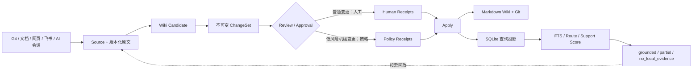

最核心的价值不是“能回答问题”，而是：

1. 知识发布形成可审核、可重放的审计链；
2. 每条正式结论能够回到确定来源版本与原文区间；
3. 来源更新后能够识别 Wiki 是否陈旧；
4. 检索相关和证据足够被明确分开；
5. 证据不足时不把模型猜测包装成项目事实；
6. 原文、Wiki、Git 和 SQLite 核心持久化默认保留在本机；
7. 全局 MCP Router 只读；项目级 MCP Agent 可以读取和提案，但不能直接获得正式知识发布权限。

### 0.1 用“技术资料出版社”理解系统

| MemoryForge 概念 | 大白话比喻 |
| --- | --- |
| Source Adapter | 收件员，接收 Git、文件、网页、飞书和 AI 会话 |
| Blob / SourceVersion | 原稿档案库，保存每一版原文 |
| Compiler | 编辑部，把原稿整理成可阅读页面 |
| ChangeSet | 待审校样，不是正式知识 |
| ReviewReceipt | 已经看过哪一版校样的记录 |
| ApprovalReceipt | 对哪一版校样授权发布的签字 |
| Apply Journal | 出版过程中断时用于恢复的操作日志 |
| Markdown Wiki | 已正式出版、可由人直接阅读的知识 |
| Git Commit | 每次出版的版本记录与回滚锚点 |
| SQLite FTS5 | 图书馆的检索目录和查询投影 |
| Citation | 脚注，指向某一版原稿的具体区间 |
| Support Score | 判断现有证据是否足够回答的质检员 |
| MCP Server | 给 Codex、Claude Code、Gemini、DeepSeek Harness 使用的借阅窗口 |

### 0.2 六个必须修正的绝对化表述

| 容易说错的版本 | 更准确的源码口径 |
| --- | --- |
| “所有变更都必须由人审核” | 普通变更由人审核；满足策略的 LOW 风险机械变更可由 Policy 生成 review/approval receipts 后自动应用 |
| “`local_only` 永远需要命令行显式授权” | CLI/MCP 通常需要显式授权；当前桌面端检测到 Trae CLI 后以 `allow_local_llm=True` 启动问答路径 |
| “Citation 类型里一定有 `source_version` 字段” | 概念上锁定来源版本；底层 `core.models.Citation` 用内容哈希和 Blob URI，查询层 CitationPayload 使用数值 `source_version` |
| “Review、Approve、Apply 一定是三次用户操作” | 三个审计语义独立，但 Portal 可以将“批准并应用”组合成一次交互 |
| “每次 Apply 都创建新 Commit” | 有正式 Wiki 文件变化时创建 Commit；无文件变化的 no-op apply 可只推进来源应用状态并返回当前 Commit |
| “MCP 只有一个写工具” | 默认知识写工具只能提案；可选 capture profile 还有事件暂存和 handoff，但任何 profile 都不暴露 approve/apply |

### 0.3 一句话技术介绍

> MemoryForge 是一个本地优先、可审计的技术知识编译器：它把多来源资料保存为版本化原文，再生成不可变 ChangeSet；正式发布必须形成与提案哈希绑定的 review/approval 凭证，并在 Apply 前重验 Git 基线、来源版本和 Citation。查询时通过 FTS5、多查询融合和 Support Score 选择少量证据，证据不足就返回 partial 或 no_local_evidence，而不是让模型补全项目事实。

---

## 1. 项目解决什么问题

### 1.1 把所有资料塞进上下文的问题

直接把 README、设计文档、代码和历史会话全部送入模型，短期简单，但会出现：

- 上下文快速膨胀，成本和延迟持续增加；
- 同样资料在每次提问中重复发送；
- 新旧文档混在一起，模型难以判断当前有效版本；
- 结论生成后无法稳定说明“当时读的是哪一版哪一段”；
- 历史会话中的猜测容易被当成当前事实；
- 私有资料更容易在不清楚边界的情况下被发送给外部模型。

### 1.2 普通 RAG 解决了什么，又遗漏了什么

普通 RAG 的典型路径是：

```text
原文 → 切片 → 向量或全文索引 → 召回片段 → 大模型回答
```

它解决了“不能每次发送全部文档”，但通常没有重点解决：

- 新内容是否经过审核后才成为正式知识；
- 某条知识来自哪个固定版本；
- 来源变化后旧知识是否自动变陈旧；
- 一次结论能否重放到原始证据；
- Agent 能否绕过审核直接覆盖索引；
- 检索到相关片段是否真的足够回答。

### 1.3 MemoryForge 在 RAG 前增加“知识编译层”

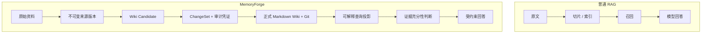

这里的“编译”可以类比软件编译器：

| 软件编译 | MemoryForge |
| --- | --- |
| 源代码 | 原始文档、代码、会话 |
| 中间表示 | SourceVersion、结构化事实、Code Symbol |
| 构建产物 | Wiki Candidate |
| 静态检查 | Citation 校验、候选树 Lint、Schema 校验 |
| 待发布制品 | ChangeSet |
| 发布版本 | Git Commit |
| 可重建索引 | SQLite 当前查询投影 |

因此，正式知识不是模型临时回答的一段文字，而是经过版本、证据、审计和发布管理的中间层。

### 1.4 项目边界

MemoryForge 面向个人开发者、技术负责人和长期维护多个仓库的人，明确不以以下能力为目标：

- 公网多租户 SaaS；
- 群聊或协同办公平台；
- 完整 RBAC、多用户认证和组织权限；
- 通用编码 Agent 或多 Agent 编排；
- 以向量数据库或知识图谱为核心的通用检索平台；
- 替代 IDE、LSP、`rg` 或完整静态分析器。

---

## 2. 总体架构

<p align="center">
  
</p>

### 2.1 六层架构

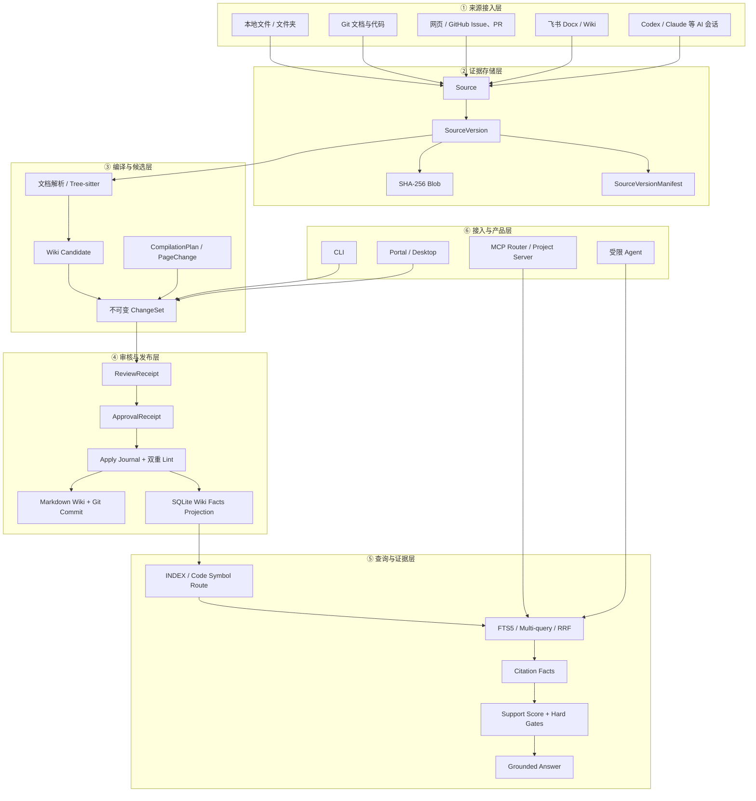

### 2.2 三种“真相”不要混淆

| 组件 | 它回答的问题 | 是否可重建 |
| --- | --- | --- |
| Blob / SourceVersion | “当时的原始资料是什么？” | 原始事实，不应从 Wiki 反推 |
| Markdown Wiki + Git | “哪些知识已经正式发布？” | 正式知识版本真相 |
| SQLite 投影表 | “当前怎样快速查询、排序？” | 可从正式 Wiki 和已有来源元数据重建 |
| SQLite 来源与运行状态 | “来源、版本、策略和任务是什么？” | 不能仅从 Wiki 完整重建，必须备份 |

MemoryForge 的设计不是把所有内容押在一个数据库里，而是按职责拆分：

- Blob 固定原文；
- Git 固定正式 Wiki 历史；
- SQLite 保存当前索引、来源状态、页面归属、策略和审计投影；
- ChangeSet 与 Receipts 固定发布决策过程。

### 2.3 两条主线

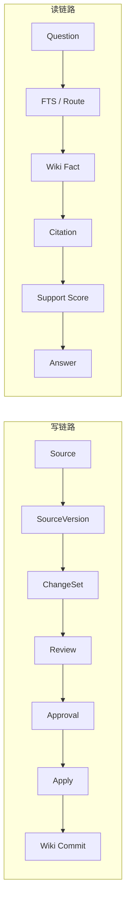

能把这两条主线讲清，再补充 Code Wiki、隐私边界和崩溃恢复，就已经抓住项目核心。

---

## 3. 技术栈与代码目录

### 3.1 技术栈分别负责什么

| 技术 | 项目中的职责 |
| --- | --- |
| Python 3.11+ | 主语言；业务逻辑、文件处理、HTTP 服务、CLI、发布脚本 |
| Pydantic 2 | 校验 Provider 输出、ChangeSet、Citation、Code Symbol、策略与返回合同 |
| Typer | `memoryforge` 命令行入口 |
| SQLite | 来源、版本、页面归属、事实索引、策略、审计和任务状态 |
| SQLite FTS5 | Source 与 Wiki Fact 的全文检索和 BM25 排序 |
| Tree-sitter | Python、Go、TypeScript/TSX 语法树解析 |
| MCP Python SDK v2 | 向 Codex、Claude Code、Gemini 暴露标准工具 |
| PyWebView | 用原生窗口承载本地 Portal |
| Git | 正式 Wiki 的版本、历史、回滚和 `base_commit` 基线 |
| `http.server` | 实现只绑定本机的 Portal HTTP 服务 |
| Ruff / Mypy / Pytest | 格式、静态检查、类型和测试门禁 |
| Hatchling / PyInstaller | Python 包与桌面制品构建 |

需要分清“依赖提供什么”和“项目自己实现什么”：

- Tree-sitter 只生成语法树；符号抽取、关系识别、稳定 ID、模块规划和 Wiki 渲染由项目实现。
- FTS5 只提供倒排和 BM25；查询改写、候选融合、RRF、来源路由和 Support Score 由项目实现。
- MCP SDK 只提供协议；工具权限、仓库作用域、证据读取和返回合同由项目实现。
- PyWebView 只提供窗口；Portal 页面、API、后台任务和审核流程由项目实现。
- Pydantic 只执行声明式校验；字段信任边界和状态流转由项目定义。

### 3.2 代码目录

```text
src/memoryforge/
├── core/                  # 核心数据合同、检索模型、出站模型
├── storage/               # Workspace、SQLite、Blob、ChangeSet、Git、Journal
├── adapters/              # 文件、Git、网页、飞书、GitHub、AI 会话接入
├── compiler/              # 来源编译、Code Wiki、发布、Lint、冲突、新鲜度
├── code/                  # Tree-sitter 代码索引、关系、影响分析
├── query/                 # 检索、排序、Support Score、问答、会话、Agent
├── interface/             # CLI、MCP Server、客户端连接
├── portal/                # 本地 Portal、桌面壳、后台任务
├── automation/            # 自动更新风险评估、策略决策、自动应用
├── evaluation/            # 评测指标与结果计算
└── client_integrations/   # Codex、Claude、Gemini 接入计划
```

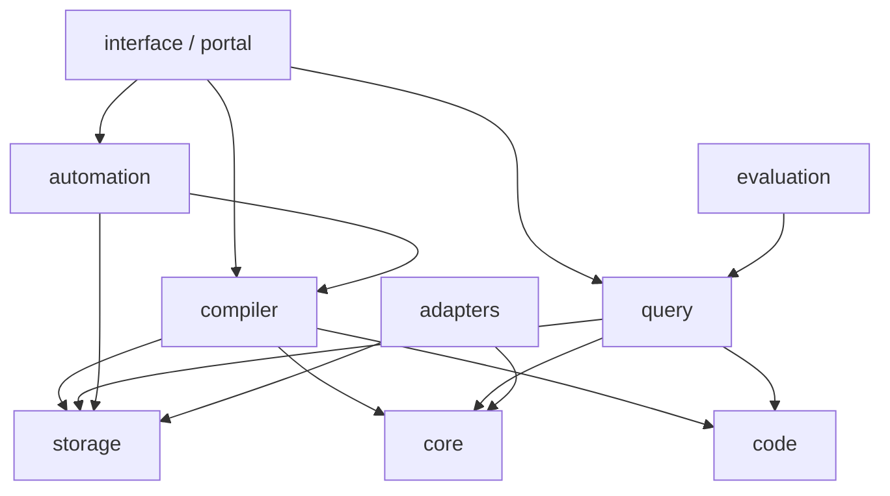

### 3.3 各目录核心职责

#### `core`

定义系统语言和不可越过的数据合同，例如：

- `LocalDocument`
- `SourceVersionManifest`
- `PageChange`
- `Citation`
- `ChangeSet`
- `ReviewReceipt`
- `ApprovalReceipt`
- `AutomationDecisionReceipt`
- `CodeSymbol`
- `RetrievalCandidate`

大量模型使用：

```python
model_config = ConfigDict(extra="forbid", frozen=True)
```

含义：

- `extra="forbid"`：未知字段直接拒绝，避免模型输出拼错字段后被静默忽略；
- `frozen=True`：对象创建后不可原地修改，降低生命周期中被偷偷改写的风险。

#### `storage`

负责：

- 初始化和打开 Workspace；
- 保存来源版本和内容寻址 Blob；
- 管理 SQLite 查询投影；
- 保存不可变 ChangeSet 和哈希凭证；
- 管理正式 Wiki 的 Git Commit；
- 写入 Apply Journal；
- 在发布中断后恢复一致状态。

#### `adapters`

每个 Adapter 只负责：

1. 读取一种外部来源；
2. 做必要安全检查；
3. 转成统一 `LocalDocument`；
4. 调用统一来源存储链路。

Adapter 不直接写正式 Wiki。

#### `compiler`

负责：

- 找出尚未发布的新来源版本；
- 生成确定性或模型辅助 Wiki Candidate；
- 创建 `INDEX.md` 和 Code Wiki 页面；
- 验证 Citation 与页面归属；
- 包装 ChangeSet；
- 实现 review、approve、apply、reject；
- 将正式页面解析为可检索 Wiki Fact。

#### `query`

负责：

- 从问题识别关键词、代码标识符、来源意图；
- 执行页面和事实召回；
- 多查询融合和重排；
- 计算 Support Score；
- 可选调用模型组织答案；
- 为 MCP 和 Agent 提供稳定业务接口。

---

## 4. 核心数据模型

### 4.1 总体关系

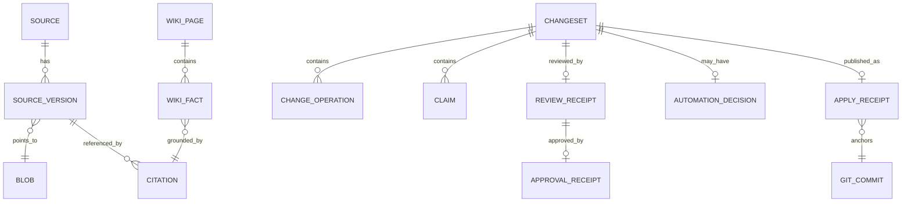

### 4.2 Source：逻辑来源

Source 表示“这是哪份资料”，不是“资料当前内容是什么”。

同一个 `docs/cache.md` 更新十次：

- `source_id` 保持不变；
- 产生十个 SourceVersion；
- 每个版本指向自己的内容哈希 Blob；
- SQLite 中只有一个版本被标为当前。

本地文件的 Source 身份大致来自：

```text
SHA256("local:" + 来源根目录身份 + ":" + 规范化相对路径)
```

Git 来源则使用规范化仓库身份和相对路径，避免把用户名、凭证或 URL 查询参数放进身份。

### 4.3 Blob：内容寻址原文

Blob 路径由内容 SHA-256 决定：

```text
raw/blobs/<哈希前两位>/<完整 SHA-256>.blob
```

特性：

- 相同内容只保存一份；
- 地址由内容决定；
- 读取时可重新计算哈希验证完整性；
- Citation 不依赖易变的文件路径或外部 URL。

### 4.4 SourceVersion：来源的某一版

SourceVersion 保存：

- 所属 Source；
- 对应 Blob；
- 上一版本；
- 标题、类型、时间和标签；
- `public` 或 `local_only`；
- 是否是当前版本。

需要准确区分两层“不可变”：

- **内容身份不可变**：SourceVersionManifest、内容哈希和 Blob 一旦写入就代表固定原文；
- **当前指针可变**：SQLite 中旧版本的 `is_current` 会在新版本到来时变为 0，新版本变为 1。

所以更准确的说法是：

> SourceVersion 的原文内容与版本身份不可变，但“哪个版本当前有效”是可更新的状态。

### 4.5 Wiki Page：正式、可读、可版本化的知识

正式页面位于 `wiki/pages/`，通常带统一 Frontmatter：

```yaml
---
title: "Cache Key Design"
type: concept
summary: "缓存键由命名空间、对象 ID 和版本组成"
tags: ["design", "cache"]
sources: ["<source_id>"]
source_version: 12
---
```

常见页面类型：

- `entity`：它是什么；
- `concept`：它如何工作；
- `synthesis`：为什么这样设计、如何取舍。

Wiki 页面是编译产物，不等于原始证据。正式事实仍需通过 Citation 回到 SourceVersion。

### 4.6 Citation：概念统一，内部类型分层

Wiki 中的事实可带脚注：

```markdown
- 缓存键包含业务命名空间和对象 ID。[^source-1]

[^source-1]: source `<source_id>` · revision `12` · `chars:120-168`
```

#### 底层 `core.models.Citation`

主要字段：

```text
source_id
content_sha256
snapshot_uri
quote
quote_sha256
locator
```

它通过 `content_sha256 + snapshot_uri` 固定原文内容身份。

#### 查询层 CitationPayload

通常包含：

```text
source_id
source_version
locator
quote
page_path
section_path
routing_text
```

它更适合查询、MCP 返回和原文展开。

统一理解：

> Citation 在语义上固定到一个确定 SourceVersion 和原文区间；不同内部类型使用数值版本 ID 或内容哈希表达版本身份。

### 4.7 Wiki Fact

`compiler/wiki_facts.py` 将正式页面中的事实解析为可检索行，每条事实包含：

- 稳定 `fact_id`；
- 页面路径与章节；
- 可用于路由的文本；
- Citation；
- 来源版本；
- 页面或代码类型信息。

Wiki Fact 是读链路中的核心中间表示：比原文短、比页面粒度细，又保留回放能力。

### 4.8 ChangeSet：不可变待审核变更

ChangeSet 记录：

- 基于哪个 Workspace Git Commit 生成；
- 使用哪些 Source 和各自版本；
- 创建、更新或归档哪些页面；
- 变更来自确定性编译、LLM 编译、Agent 提案还是用户创作；
- 候选页面内容；
- Claim 与 Citation；
- 校验信息和风险来源。

ChangeSet 创建后，原始 `changeset.json` 保持 `PROPOSED`，后续状态不是靠反复覆盖它，而是追加：

```text
review.json
review.sha256
approval.json
approval.sha256
decision.json            # 自动化决策可选
decision.sha256
receipt.json             # applied / rejected 归档结果
```

Approval 绑定 Review 的哈希，Review 又绑定 Proposal 的哈希，因此不能“看完 A 后偷偷替换成 B 再发布”。

---

## 5. Workspace 内部结构

执行：

```bash
memoryforge init ./my-wiki
```

典型结构：

```text
my-wiki/
├── raw/
│   └── blobs/                         # 内容寻址原文
├── wiki/
│   ├── INDEX.md                       # 正式页面目录
│   └── pages/                         # 正式 Wiki 页面
├── .memoryforge/
│   ├── index.sqlite                   # 当前查询投影和状态
│   ├── manifests/sources/             # SourceVersion 清单
│   ├── staging/
│   │   ├── <changeset-id>/            # 待审核 Proposal
│   │   ├── applied/<changeset-id>/    # 已应用归档
│   │   └── rejected/<changeset-id>/   # 已拒绝归档
│   ├── sessions/                      # 有上限的会话状态
│   ├── traces/                        # 本地追踪数据
│   ├── config.yaml
│   └── schema.yaml
├── AGENTS.md                          # Workspace 使用约束
├── .memoryforgeignore
├── .gitignore
└── .git/                              # 正式 Wiki 版本历史
```

> [!NOTE]
> 拒绝的 ChangeSet 实际归档在 `.memoryforge/staging/rejected/`，而不是独立的 `.memoryforge/rejected/`。

### 5.1 目录职责图

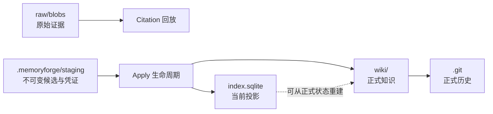

### 5.2 SQLite 中哪些内容可重建

SQLite 很重要，但主要承担：

- 当前 SourceVersion；
- 已应用来源版本；
- 页面归属；
- Wiki Facts / FTS；
- 审计和策略记录；
- 后台任务状态。

正式 Wiki 的文件内容和版本历史由 `wiki/ + Git` 固定，原文由 Blob 固定。Apply 中断且
SQLite 来源元数据仍完整时，系统可以用 Journal、Git 和正式页面恢复
`applied_source_versions`、`page_sources`、`wiki_facts` 等投影。

这不等于整个 `index.sqlite` 可以从 Wiki 无损重建。来源、SourceVersion、仓库登记、策略、
任务等数据仍依赖数据库；数据库整体损坏时应恢复已验证备份，而不是删除后重建。

---

## 6. 写链路总览

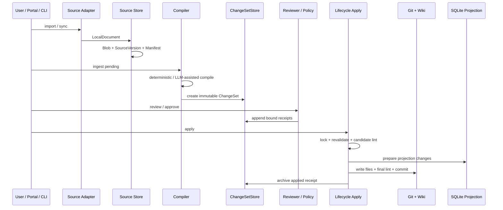

写链路的核心不是“生成 Markdown”，而是保证：

- 原文版本固定；
- 候选不可变；
- 审核对象固定；
- 发布前重新校验；
- 失败可恢复；
- 正式知识有 Git 锚点。

---

## 7. 初始化与来源导入

### 7.1 初始化 Workspace

入口：

- CLI：`interface/cli.py::init`
- 核心：`storage/workspace.py::Workspace.initialize`

典型过程：

1. 规范化目标路径；
2. 拒绝危险符号链接；
3. 拒绝覆盖已存在的核心目录；
4. 创建私有目录并设置权限；
5. 写默认配置、Schema、AGENTS 和 Ignore；
6. 创建 SQLite 表与 FTS5；
7. 初始化 Git；
8. 创建 baseline commit。

为什么初始化就建 Git：

> 后续每个 ChangeSet 都绑定 `base_commit`。没有稳定基线，就无法判断候选生成后正式 Wiki 是否已经被其他操作修改。

### 7.2 来源导入统一流程

以本地文档为例：

```bash
memoryforge import /path/to/design.md --workspace ./my-wiki
```

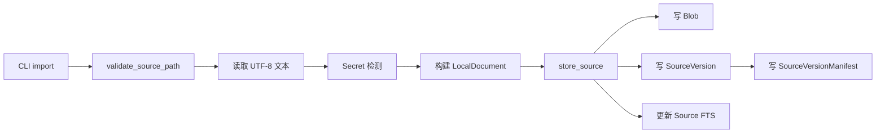

Adapter 的价值是把多种外部格式统一成：

```python
LocalDocument(
    source_uri=...,
    source_path=...,
    media_type=...,
    category=...,
    title=...,
    content=...,
    sensitivity=...,
    tags=...,
)
```

后续编译器不需要关心资料来自飞书、Git、网页还是本地文件。

### 7.3 本地文件导入安全检查

`adapters/importer.py` 对普通本地文档至少检查：

- 必须位于允许的根目录内；
- 不接受符号链接；
- 普通本地文档只允许 `.md`、`.markdown`、`.txt`；
- 单文件不超过 5 MiB；
- 必须是 UTF-8；
- 遵守 `.memoryforgeignore`；
- 拒绝私钥、常见 Token 和高置信度 Secret；
- 使用规范化相对路径构造稳定 Source 身份。

Git Code Adapter 可额外处理 `.py`、`.go`、`.ts`、`.tsx` 等代码类型，但它走的是 Git 快照读取和代码索引链路，不等于普通文件导入器接受所有源码后缀。

### 7.4 网页导入安全边界

网页导入会进一步限制：

- 只允许 HTTP/HTTPS；
- 禁止 URL 中携带用户名和密码；
- DNS 解析结果必须是允许的公网地址；
- 请求固定到已校验地址，降低 DNS Rebinding 风险；
- 限制跳转次数和响应大小；
- 对最终来源身份和内容建立版本记录。

### 7.5 为什么 Import 后还不能直接回答

导入只表示：

> 系统收到了一版新原稿。

不表示：

> 这版原稿已经成为正式知识。

系统分别维护：

```text
source_versions.is_current       # 最新导入版本
applied_source_versions          # 正式 Wiki 当前使用版本
```

这使系统能够表达：

```text
原始资料已经更新，但正式 Wiki 尚未审核更新。
```

这也是 Freshness 判断和 stale ChangeSet 拒绝的基础。

---

## 8. 来源编译与 ChangeSet 生成

入口：

```bash
memoryforge ingest --pending --workspace ./my-wiki
```

核心：`compiler.compiler.compile_pending_sources`

### 8.1 找出待编译来源

```text
current source version != applied source version
```

满足条件的来源才进入编译。因此增量更新不是靠猜测文件哪一行变了，而是比较稳定版本身份。

### 8.2 两种编译路径

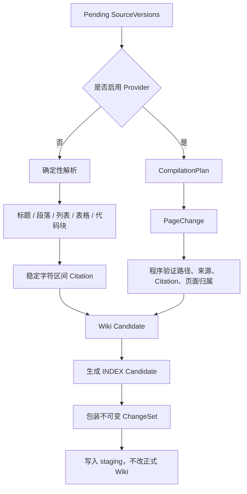

### 8.3 确定性编译

未启用模型时，编译器会：

1. 解析 Markdown 结构；
2. 为事实保留原文字符范围；
3. 生成统一页面和脚注；
4. 更新候选 `INDEX.md`；
5. 计算稳定 ChangeSet ID；
6. 输出 Compilation，不写正式 Wiki。

“确定性”表示在相同输入、相同 Git 基线和相同编译逻辑下，结果应稳定可重放。

### 8.4 LLM 辅助编译

Provider 可以提议：

- 页面标题；
- 页面类型；
- 摘要和正文；
- 来源组合；
- Citation 字符区间；
- 页面规划和冲突说明。

Provider 不能直接控制：

- 正式 Wiki 写入；
- Git Commit；
- Review / Approval / Apply；
- 任意文件路径；
- 未提供的 Source；
- 页面既有来源归属；
- 确定性 Code Symbol 和 Relation。

程序会重验：

- 路径必须在 `wiki/pages/`；
- 每个待处理来源必须按合同出现；
- 不能引用未提供来源；
- Citation 不能越界或为空；
- 页面不能注入保留 Frontmatter、脚注或保留章节；
- 更新旧页面不能偷换所有权；
- AI 会话结论不能把用户问题伪装成 Assistant 结论。

正确说法：

> LLM 负责提出结构化候选，程序负责限定写集、校验证据和决定能否进入审核链。

### 8.5 为什么 Candidate 不直接写 Wiki

ChangeSetStore 把候选放入：

```text
.memoryforge/staging/<changeset_id>/
```

发布前会校验：

- `base_commit` 与当前 Workspace 基线一致；
- Source 和 Citation 存在；
- Proposal 元数据哈希正确；
- 同一个 ChangeSet ID 的重复请求内容必须完全一致；
- 候选路径不能越过 Wiki 边界；
- 候选页面只能声明允许的来源。

它相当于一份不可变安装包：先生成、再审核，审核对象和最终安装对象必须是同一份内容。

---

## 9. Review、Approve 与 Apply

<p align="center">
  
</p>

### 9.1 审计状态与持久化事实

概念状态机：

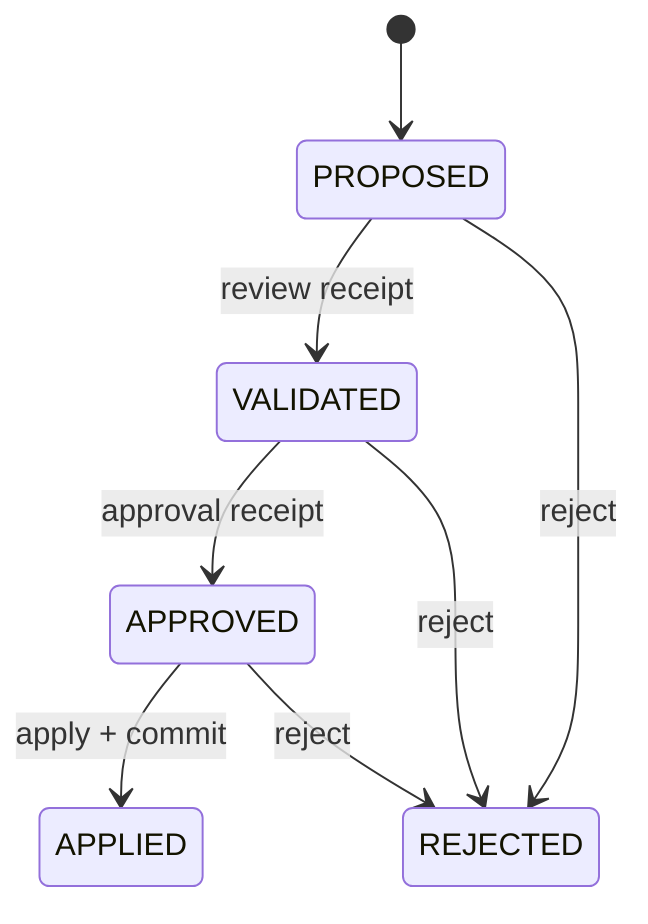

但磁盘持久化更严格：

- 原始 `changeset.json` 始终保持 `PROPOSED`；
- Review 追加独立 Receipt；
- Approve 追加独立 Receipt；
- Apply 成功后移动到 `staging/applied/` 并写 Receipt；
- Reject 后移动到 `staging/rejected/`。

这避免把同一 JSON 反复改成“已审核、已批准、已应用”，从而保留完整审计证据。

### 9.2 Review

`review_changeset` 主要做：

1. 读取不可变候选；
2. 从 `base_commit` 读取旧页面；
3. 生成 unified diff；
4. 展示来源、影响页面和告警；
5. 写入绑定 Proposal SHA-256 的 ReviewReceipt。

Review 表示“某个 actor 已看过某个固定 Proposal”。

### 9.3 Approve

`approve_changeset`：

1. 要求 ReviewReceipt 已存在；
2. 重验 ReviewReceipt 与 Proposal 的绑定；
3. 写 ApprovalReceipt；
4. ApprovalReceipt 绑定 Proposal 哈希和 Review 哈希。

Approve 不修改正式 Wiki，也不产生 Git Commit。

### 9.4 Apply

典型写入路径：

1. 获取 Workspace 排他锁；
2. 获取待应用 ChangeSet；
3. 校验 ApprovalReceipt；
4. 校验 `base_commit`；
5. 校验 SourceVersion 仍是当前版本；
6. 校验候选页面和 Citation；
7. 在临时目录构造候选 Wiki 与投影；
8. 对候选树执行 Lint；
9. 写 Apply Journal；
10. 更新 `applied_source_versions`、`page_sources`、`wiki_facts`；
11. 写入或删除正式 Wiki 文件；
12. 再执行正式 Wiki Lint；
13. 只提交本次涉及的 Wiki 路径；
14. 在 Journal 记录 Commit；
15. 归档 ChangeSet 并清理 Journal。

### 9.5 三个审计阶段不等于三次用户操作

审计语义必须分离，但交互层可组合：


因此应说：

> Review、Approve 和 Apply 是三种独立审计语义与凭证；Portal 可以将它们组合为一次明确的用户动作。

### 9.6 人工审批与策略审批

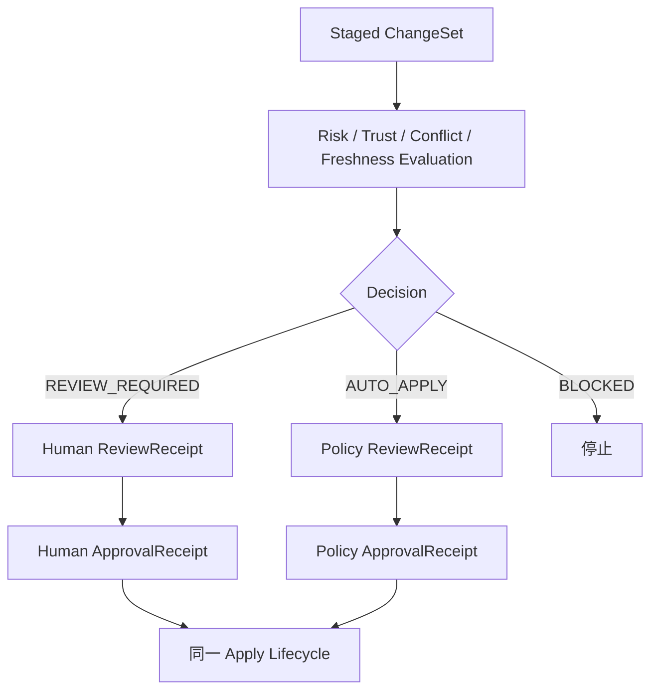

最稳定的不变量是：

> 正式发布不能绕过与 Proposal 绑定的 review/approval receipts；actor 可以是 Human，也可以是受限 Policy。

LLM Compiler 和 MCP Agent 仍然不能自行批准正式知识。

### 9.7 no-op Apply 的边缘情况

若 ChangeSet 没有正式 Wiki 文件路径需要变化，Apply 可以：

- 重验 SourceVersion；
- 校验来源归属；
- 记录已应用来源版本；
- 归档 ChangeSet；
- 返回当前已有 Commit，而不是创建新的空 Commit。

所以“Apply 总会产生新 Git Commit”只对有正式文件变化的常规路径成立。

---

## 10. 一致性、故障恢复与并发控制

### 10.1 这不是跨介质 ACID 事务

MemoryForge 同时写：

- SQLite；
- 文件系统；
- Git；
- ChangeSet 归档。

它们无法放进一个真正的跨介质 ACID 事务。因此实现采用：

- 单机排他锁；
- 提交前重验；
- 候选树 Lint；
- 写前 Journal；
- 补偿恢复；
- 启动时恢复；
- Git Commit 作为稳定锚点；
- 无法证明一致时 fail closed。

最准确描述：

> 单机环境中的日志式提交与补偿恢复流程。

不要说“实现了分布式事务”或“绝对原子”。

### 10.2 `base_commit` 相当于乐观锁

ChangeSet 生成时：

```text
base_commit = 当前正式 Wiki Git HEAD
```

发布前要求：

```text
ChangeSet.base_commit == Workspace.current_commit()
```

若审核期间其他变更已应用，HEAD 会变化，旧 ChangeSet 不能覆盖新状态。

### 10.3 SourceVersion 防止发布过期草稿

ChangeSet 同时保存：

```text
source_id -> source_version
```

Apply 时要求这些来源版本仍然是当前版本。若原文在审核期间又更新，旧草稿失效。

### 10.4 双重 Lint

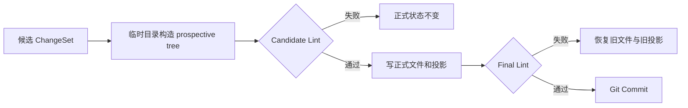

第一次 Lint 预测变更应用后是否有效；第二次 Lint 验证真实落盘结果是否有效。

### 10.5 Apply Journal 与恢复

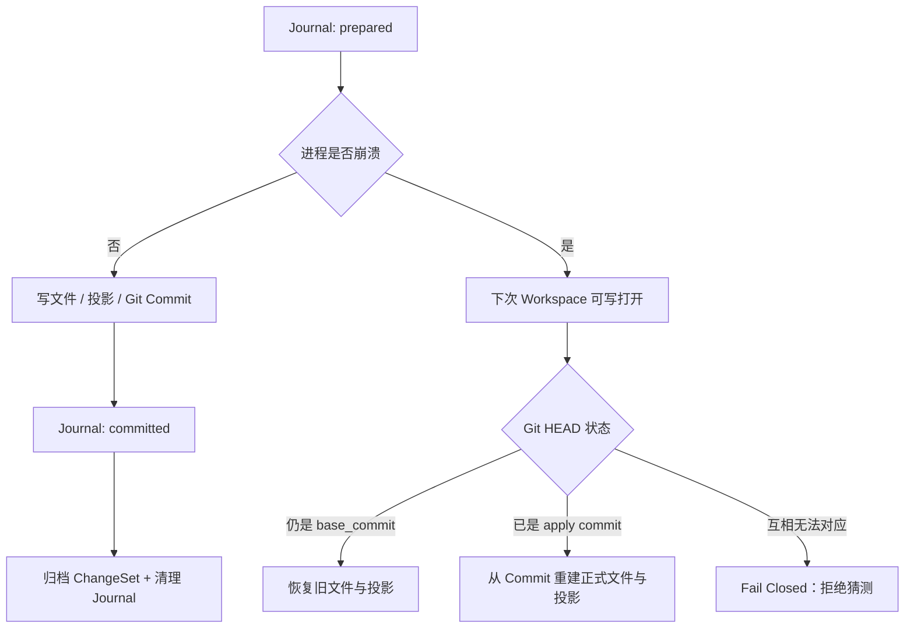

恢复原则：

- HEAD 仍是旧基线：说明 Commit 未完成，回滚；
- HEAD 已是目标 Commit：说明文件发布成功，补齐归档和投影；
- Journal、ChangeSet 和 Git 无法互相证明：停止自动恢复。

### 10.6 并发控制

Workspace 写操作使用排他锁，ChangeSet 又绑定 `base_commit` 和 SourceVersion。

若两个任务同时基于同一 HEAD 生成草稿：

1. 第一个先 Apply，HEAD 改变；
2. 第二个再尝试时，其 `base_commit` 已陈旧；
3. 系统拒绝覆盖，而不是“最后写入者获胜”。

这相当于文件与 Git 层面的 CAS / 乐观并发控制。

---

## 11. 查询、检索与证据充分性

<p align="center">
  
</p>

### 11.1 查询主路径

入口：

```bash
memoryforge ask "为什么 approve 和 apply 要分开？" \
  --workspace ./my-wiki
```

核心：`query.query.answer_question`

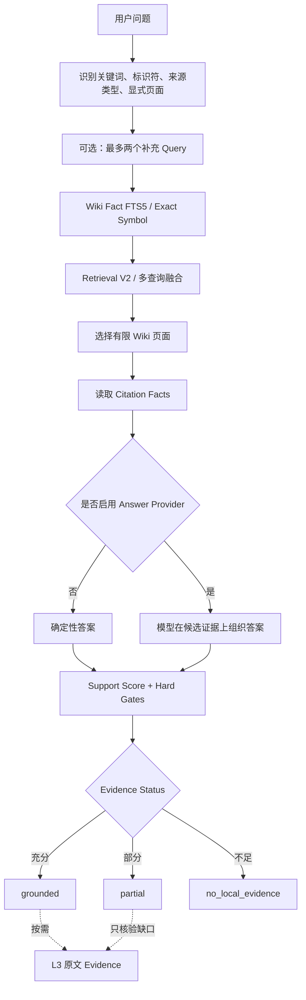

上图描述 CLI 和 Portal 的直接回答路径。MCP 对全局问题还会先执行一次 map-first 导航。

### 11.2 MCP 的 map-first 两阶段查询

当 `memoryforge_context` 识别到“整体架构、为什么这样设计”等全局问题，且问题中没有
显式代码标识符时，第一次调用只返回导航地图：

```json
{
  "status": "ok",
  "mode": "map",
  "navigation_only": true,
  "map": [
    {"title": "...", "page_path": "...", "summary": "...", "kind": "..."}
  ]
}
```

这些条目只能用于选路，不能作为事实证据。AI Host 选择相关路径后，使用同一问题和
`page_paths` 再次调用 `memoryforge_context`，第二次响应才进入 Wiki Fact、Citation、
Support Score 和三态证据合同。


因此，只有回答型 Context 响应才使用 `evidence_status`；导航型 map 响应只有
`status: ok`，不应被解释成已经得到有证据的答案。

### 11.3 L0 到 L3 渐进式披露

| 层级 | 读取内容 | 目的 |
| --- | --- | --- |
| L0 | `INDEX.md`、仓库概览或 Code Symbol 投影 | 找候选主题和路由 |
| L1 | 少量候选 Wiki 页面 | 找相关事实 |
| L2 | 页面内 Citation Fact | 形成受约束回答上下文 |
| L3 | Citation 对应原文区间 | 最终核验 |

默认上限：

- 最多选择 3 个 Wiki 页面；
- 最多返回 6 条 Citation；
- 模型组织答案时最多使用 12 条筛选后的可用事实。
- map-first 完整响应最多 4,000 字符；
- MCP 回答型 Context 完整响应最多 8,000 字符；
- 单条原文 Evidence 最多 2,000 字符；
- Session Capsule 默认 6,000 字符，调用端可调但最高 12,000 字符。

这些上限避免把整个 Wiki 或全部会话重新灌入上下文。

### 11.4 Query Rewrite

当前桌面问答 Provider 可在问题没有显式页面标题或精确代码符号时生成最多两个补充 Query。

例如：

```text
原问题：这个系统怎么避免 AI 胡编？
补充 1：Citation 证据校验 Support Score
补充 2：grounded partial no_local_evidence 拒答机制
```

Query Rewrite 只扩大召回，不直接生成最终项目答案。

### 11.5 Retrieval V2 的多路候选

`query/retrieval_v2.py` 定义的通道包括：

1. **exact lane**：精确代码标识符；
2. **lexical lane**：词法匹配和 IDF；
3. **relation lane**：从符号扩展代码关系；
4. **cross repository lane**：跨仓库问题；
5. **source kind preference**：代码、飞书、会话、普通笔记偏好。

当前主 `answer_question` 路径已经接入 Wiki Fact、多查询和候选融合；relation lane 的接口存在，但该主调用点没有始终注入完整 `code_symbols` 和 `code_relations`。

因此不能宣传：

> 所有查询都会执行完整图关系扩展。

更准确：

> 精确符号和词法路径已进入主问答，完整关系图扩展仍是可继续深化的能力。

### 11.6 RRF 融合

多个 Query 会产生多份排序。Reciprocal Rank Fusion 使用排名而不是原始分数：

```text
RRF score = Σ 1 / (60 + rank)
```

优点：

- 不要求不同召回通道的分数同量纲；
- 在多个 Query 中都靠前的事实自然上升；
- 计算简单、可解释、稳定。

### 11.7 为什么召回后还需要 Support Score

“找到相关内容”不代表“足以回答问题”。Support Score 计算：

| 分量 | 含义 | 权重 |
| --- | --- | ---: |
| 精确标识符覆盖 | 类、函数、字段是否真正命中 | 20% |
| 核心问题词覆盖 | 关键概念是否被证据覆盖 | 35% |
| 事实共现 | 条件和结论是否在同一事实附近 | 15% |
| 否定一致性 | “不能、没有、未”等是否一致 | 10% |
| 多来源覆盖 | 是否拿到足够独立来源 | 5% |
| 指定来源组覆盖 | 显式指定资料是否逐组命中 | 5% |
| 当前版本 | Citation 是否仍是已应用版本 | 10% |

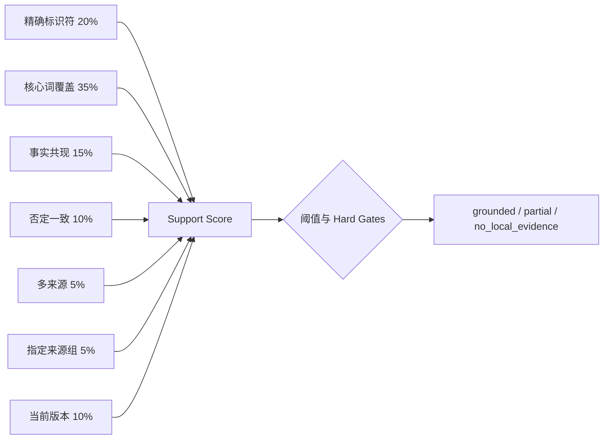

公式：

```text
score = 100 × (
    0.20 × exact_identifier_coverage
  + 0.35 × core_term_coverage
  + 0.15 × fact_co_location
  + 0.10 × negation_alignment
  + 0.05 × multi_source_coverage
  + 0.05 × source_group_coverage
  + 0.10 × current_source_versions
)
```

阈值是 75，但不是所有普通问题都强制按单一分数硬裁决。代码问题、显式来源、多来源问题和会话结论会启用更严格的 Hard Gates。

### 11.8 三种证据状态

| 状态 | 含义 | 合理回答行为 |
| --- | --- | --- |
| `grounded` | 本地证据足以支持项目结论 | 给出结论和 Citation |
| `partial` | 只支持问题的一部分 | 只陈述已证实部分并标出缺口 |
| `no_local_evidence` | 没有足够本地项目证据 | 明确没有项目依据；通用分析必须标明是通用信息 |

必须区分：

```text
status: ok                    # 工具调用成功
evidence_status: grounded     # 内容证据足够
```

接口成功不等于答案有依据。

### 11.9 模型在查询链路中的权限

模型接收的是有限、已筛选、按策略处理过的候选事实。它返回：

```json
{
  "answer": "根据给定事实组织出的答案",
  "citation_indexes": [0, 2]
}
```

程序随后检查：

- Citation 下标有效；
- 至少选择一条 Citation；
- Citation 不重复；
- 来源允许用于该 Provider；
- 最终选择仍满足 Support Score 和 Hard Gates；
- Provider 失败时可回退到确定性可读答案。

模型负责表达，不负责从系统外凭空创造项目事实。

---

## 12. Code Wiki

### 12.1 Code Wiki 的目标

它不替代 IDE、LSP、`rg` 或完整编译器，而是回答：

- 这个模块负责什么；
- 主要入口在哪里；
- 模块之间有什么依赖；
- 某个符号在哪定义；
- 哪条源码关系支持一条架构边；
- 一个改动可能影响哪些符号或调用路径。

### 12.2 从固定 Git 快照读取代码

```bash
memoryforge git-add /path/to/repo --workspace ./my-wiki
memoryforge code-add <repository-id> src --workspace ./my-wiki
memoryforge git-sync <repository-id> --workspace ./my-wiki
```

Git Adapter 使用类似：

```text
git ls-tree <commit>
git show <blob>
```

它读取指定 Commit 的对象，而不是直接信任可能含未提交修改的工作区文件。

### 12.3 Tree-sitter 到 Code Wiki

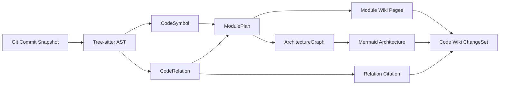

统一 CodeSymbol 可表示：

- module / package；
- class / interface / struct；
- function / method；
- qualified name；
- signature；
- SourceVersion；
- 字符区间和行号。

CodeRelation 可表示：

- `contains`；
- `imports`；
- `calls`；
- `extends`；
- `implements`；
- `tests`；
- 关系对应的源码证据。

Symbol 和 Relation ID 由仓库、路径、类型和限定名构造，不依赖本次运行顺序。

### 12.4 模块规划与架构图

`compiler/module_planner.py`：

1. 按路径和结构将 Symbol 分配到模块；
2. 构建模块树；
3. 根据依赖稳定排序；
4. 将 CodeRelation 聚合为模块级 ArchitectureEdge；
5. 为模块生成稳定 Wiki 路径。

架构图不是让模型凭印象自由绘制：节点来自 ModulePlan，边来自确定性 CodeRelation，并保留源码 Citation。

### 12.5 LLM 在 Code Wiki 中的边界

可选 Provider 可以补充：

- 模块职责；
- 子模块分工；
- 核心流程叙事；
- 已有确定性事实的自然语言组织。

它不能修改：

- Symbol 身份；
- Relation；
- ArchitectureGraph；
- 源码定位；
- 确定性 Citation。

Provider 失败时保留确定性页面并标记 fallback。

### 12.6 静态分析限制

Tree-sitter 识别语法结构很可靠，但无法保证完整理解：

- 反射；
- 动态分派；
- 运行时依赖注入；
- 字符串拼接调用；
- 动态模块加载；
- 生成代码；
- 跨进程或配置驱动关系。

因此 Code Wiki 图是“有源码依据的静态近似”，不是运行时全知图。

---

## 13. MCP、Agent、Portal 与桌面端

<p align="center">
  
</p>

### 13.1 MCP Server

MCP 有两种服务形态，工具面不能混为一谈：

| 工具 | 全局 Router | 项目级 Server | 作用 |
| --- | :---: | :---: | --- |
| `memoryforge_context` | ✓ | ✓ | 返回导航地图或有限带引用上下文 |
| `memoryforge_read_evidence` | ✓ | ✓ | 展开一条 Citation 的原文 |
| `memoryforge_recall` | ✓ | ✓* | 读取已应用的近期会话摘要 |
| `memoryforge_sessions` | ✓ | ✓ | 列出历史会话 |
| `memoryforge_episodes` | ✓ | ✓ | 按主题组织会话 |
| `memoryforge_load_session` | ✓ | ✓ | 显式加载指定会话 |
| `memoryforge_status` | ✓ | ✓ | 返回绑定、仓库和 Workspace 诊断 |
| `memoryforge_propose_update` | — | ✓ | 从已读 Citation 生成 PROPOSED ChangeSet |
| `memoryforge_list_changesets` | — | ✓ | 列出候选变更 |
| `memoryforge_review_changeset` | — | ✓ | 只读预览 Diff 和 Citation 摘要 |

\* 项目级 `micro` profile 不注册 `memoryforge_recall`；其余会话选择和加载工具仍保留。

关键权限边界：

- 推荐的全局 Router 是只读服务；
- `memoryforge_propose_update` 只能暂存 Proposal；
- MCP 不暴露 approve；
- MCP 不暴露 apply；
- 正式 Wiki 和 Git HEAD 不会被 Agent 直接修改。

### 13.2 MCP Profile

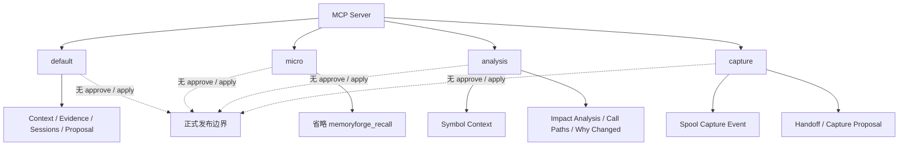

因此：

> 默认知识写工具只有 Proposal；capture profile 还有本地事件暂存和 handoff，但所有 profile 都不获得正式发布权限。

### 13.3 Project Server 与全局 Router

- Project Server 将 `project_root` 固定映射到已注册 Git 仓库；
- 若无法映射，会拒绝启动，而不是静默降级到整个 Workspace；
- 全局 Router 可查整个已应用 Workspace；
- 当前项目 Root 主要作为排序偏好，不是绝对访问边界；
- 显式仓库名称和来源范围可以进一步收紧查询。

当前支持的客户端接入包括：

```bash
memoryforge connect codex --workspace /absolute/path/to/my-wiki
memoryforge connect claude --workspace /absolute/path/to/my-wiki
memoryforge connect harness --workspace /absolute/path/to/my-wiki
```

DeepSeek Harness 接入会写入受管 `cordis.patch.yml` 片段并安装
`memoryforge-knowledge` Skill；默认仍只允许读取 `public` 来源。Gemini 使用
`memoryforge client plan gemini` 生成接入计划。

### 13.4 受限 Agent

Mini Agent 的动作空间类似：

```text
search_wiki
read_evidence
search_code（仅授权本地路径）
final
```

它没有：

- Shell；
- 任意文件写入；
- 子 Agent；
- approve/apply；
- 自由网络工具。

最终回答通常要求：

- 非空；
- 至少一个 Citation；
- Citation 下标有效；
- 最终使用的 Citation 已读取原文；
- 答案通过证据支持检查。

失败时按具体原因重试，例如：

- `missing_citations`；
- `unread_citations`；
- `unsupported_answer`。

超过最大步数则停止。

### 13.5 会话记忆

历史会话不是直接作为事实：

- 用户消息主要是检索线索；
- Assistant 结论标为未验证会话记忆；
- 重新编译会话仍然产生待审核 ChangeSet；
- 重要结论应以当前代码或正式来源为准；
- Episode 只帮助按主题选择要加载的会话，不自动把全部历史灌入上下文。

会话重编译有两条明确路径：

```bash
memoryforge recompile conversations --workspace ./my-wiki
memoryforge recompile conversations --workspace ./my-wiki --trae --allow-local-llm
```

第二条路径会把 `local_only` 会话发送给 Trae CLI，固定使用
`gpt-5.6-sol__max` 和 `xhigh` 推理强度，因此必须显式授权。它与桌面问答不是同一个
Provider：桌面问答使用 `TraeCliAnswerProvider` 和 `Doubao-Seed-2.1-Turbo`；会话重编译使用
`TraeCliProvider`。两条重编译路径都只生成 `PROPOSED` ChangeSet。

<p align="center">
  
</p>

### 13.6 Portal

Portal 直接使用 Python `ThreadingHTTPServer`：

- GET：概览、项目、来源、页面、任务和更新；
- POST：导入、刷新、审核操作和提问；
- `PortalJobManager`：串行执行长任务，避免阻塞请求线程；
- 页面和 CLI 最终复用相同 compiler、query、storage 业务函数。

### 13.7 桌面端

<p align="center">
  
</p>

桌面端通过 PyWebView：

1. 选择或恢复最近 Workspace；
2. 在随机本地端口启动 Portal；
3. 创建原生窗口；
4. 窗口关闭后停止服务器线程。

当前 `desktop.py` 会：

```python
LocalPortalServer(
    selected,
    port=0,
    answer_provider=default_trae_cli_provider(),
    allow_local_llm=True,
)
```

含义：

- 优先发现本机 `trae-cli` / `traex`；
- 默认问答模型配置为 `Doubao-Seed-2.1-Turbo`；
- 使用已登录 CLI，不把凭据暴露给 MemoryForge；
- Provider 不可用时回退到确定性答案；
- 桌面问答路径默认允许该 Provider 使用经过检索和策略处理后的本地证据。

这也是“本地优先”不应被夸大成“任何模式下任何字节都绝不会离开本机”的原因。

---

## 14. 隐私和安全边界

### 14.1 默认敏感级别

| 来源 | 默认 Sensitivity |
| --- | --- |
| 本地文件 / 文件夹 | `local_only` |
| 本地 Git 仓库 | `local_only` |
| 飞书文档 | `local_only` |
| AI 会话 | `local_only` |
| 显式公开网页 | `public` |
| 公开 GitHub Issue / PR | `public` |

### 14.2 “Local-first”的准确含义

```mermaid
flowchart LR
    A["Blob / Wiki / Git / SQLite"] -->|"默认持久化"| B["本机"]
    C["可选模型辅助"] --> D["出站策略"]
    D --> E["来源敏感级别检查"]
    E --> F["脱敏与字符上限"]
    F --> G["Provider"]
    F --> H["DisclosureReceipt"]
```

可以准确地说：

- 核心持久化是本地的；
- 不启用 Provider 时可完全本地执行确定性路径；
- 启用模型辅助时，只发送有限候选，而不是整个资料库；
- 发送前检查来源、策略、脱敏和字符上限；
- 记录 DisclosureReceipt；
- CLI/MCP 通常要求显式本地授权；
- 当前桌面端为检测到的 Trae CLI 默认开启本地证据问答。

### 14.3 出站控制

发送模型前可执行：

1. 检查 Source sensitivity；
2. 应用 source egress rule；
3. 对 Token、私钥和敏感环境变量脱敏；
4. 限制发送字符数；
5. 记录 DisclosureReceipt。

DisclosureReceipt 保存：

- 请求身份；
- Host 和仓库身份；
- 策略哈希；
- 内容哈希；
- SourceVersion 引用；
- 字符数；
- 脱敏次数。

它不再保存一份新的完整明文副本。

### 14.4 文件系统边界

代码大量使用：

- `O_NOFOLLOW`；
- `O_DIRECTORY`；
- `dir_fd`；
- 私有目录权限；
- 临时文件和 `fsync`；
- 原子 rename / replace；
- 路径标准化与 Workspace 边界检查。

目标是降低：

- 路径穿越；
- 符号链接替换；
- 写到 Workspace 外；
- 半写文件被当完整文件；
- ChangeSet 元数据被篡改；
- TOCTOU 路径竞争。

### 14.5 Portal 边界

Portal：

- 只绑定 `127.0.0.1`；
- 校验 Host；
- 写请求校验同源 Origin；
- 使用内存 CSRF Token；
- 设置 CSP、frame、MIME、referrer 等安全响应头。

它不是公网服务，也没有多用户认证体系。不要因为它有浏览器界面就把它当作可直接暴露到互联网的 Web 应用。

---

## 15. 自动更新为何没有绕过审计链

### 15.1 风险评估维度

Automation 会考虑：

- 变更来源 `origin`；
- 创建、更新或归档；
- 是否跨多个 Source；
- 是否修改受保护内容；
- Source Trust；
- 改动页面数和行数；
- `base_commit` 是否变化；
- SourceVersion 是否陈旧；
- 是否存在开放冲突。

典型风险口径：

| 变更 | 常见风险 |
| --- | --- |
| 确定性、单来源、机械更新 | LOW |
| 跨来源合并或较大编辑 | MODERATE |
| LLM Compilation / Agent Proposal | HIGH |
| 归档或受保护页面 | CRITICAL |

### 15.2 自动应用流程

```mermaid
flowchart LR
    A["Refresh / Ingest"] --> B["Staged ChangeSet"]
    B --> C["Deterministic Evaluation"]
    C --> D{"AUTO_APPLY?"}
    D -->|"否"| E["Deferred / Review Required / Blocked"]
    D -->|"是"| F["DecisionReceipt"]
    F --> G["Policy ReviewReceipt"]
    G --> H["Policy ApprovalReceipt"]
    H --> I["Normal Apply Lifecycle"]
    I --> J["Journal + Lint + Git Commit + Projection"]
```

自动化没有第二套后门写入逻辑。它复用同一个 Apply 生命周期，并在 Commit Message 与数据库中记录 Policy、Validation、Proposal 哈希。

### 15.3 为什么这仍然是“审核”

审核的核心不是“必须有人点击”，而是：

- 有明确 actor；
- 有确定 policy；
- 决策绑定固定 Proposal；
- 决策输入和验证结果可重放；
- 不符合策略则 fail closed；
- 最终仍重验当前基线和来源版本。

所以更准确的项目口径是：

> 正式知识必须经过可审计 review/approval；普通语义变更由人处理，受严格策略约束的 LOW 风险机械变更可由 Policy 处理。

---

## 16. Benchmark 与发布门禁

### 16.1 公开 30 题评测

固定条件：

- 来源仓库：`AgentSkill-Eval@93f5dc0`；
- 56 个公开来源文件；
- 30 道题；
- 16 道单来源；
- 5 道多来源；
- 4 道无答案；
- 5 道同义改写；
- 每题最多展开 3 个 Wiki 页面；
- 不调用模型；
- 不使用 LLM Judge。

仓库记录结果：

| 指标 | MemoryForge | Raw FTS |
| --- | ---: | ---: |
| Top-3 来源召回率 | **96.2%** | 57.7% |
| 多来源完整覆盖率 | **100.0%** | 20.0% |
| 回答准确率 | **96.7%** | 不适用 |
| Citation 落地准确率 | **100.0%** | 不适用 |
| 无答案拒答准确率 | **100.0%** | 不适用 |
| 平均展开 Wiki 页面 | 3.0 | 不适用 |
| 平均证据 / 候选文本字符数 | 159.2 | 728.0 |

简易可视化：

```text
Top-3 来源召回        MemoryForge  96.2%  ███████████████████▏
                     Raw FTS      57.7%  ███████████▌

多来源完整覆盖         MemoryForge 100.0%  ████████████████████
                     Raw FTS      20.0%  ████
```

### 16.2 每个指标证明什么

- **Top-3 来源召回率**：正确来源是否进入最终候选或 Citation；
- **回答准确率**：状态、关键事实和冻结来源是否同时正确；
- **Citation grounding**：引用能否回到原文，不代表答案语义一定正确；
- **拒答准确率**：没有证据的问题是否拒绝伪造项目答案；
- **多来源完整覆盖率**：跨文档问题是否拿齐要求来源。

### 16.3 公开题集保留的一道严格失败

“前端页面使用 React 还是 Vue？”这一题：

- 系统回答 Vue；
- Citation 可以落到有效 Vue 证据；
- 但命中的来源不是题集冻结的那一份，而是另一份同样包含 Vue 事实的文档；
- 因而 Citation grounding 正确，但严格 Answer Accuracy 和冻结 Source Recall 记为失败。

这说明：

> Citation 能回放和命中“某个正确事实”，仍不等于满足题集规定的全部答案合同。

### 16.4 为什么必须保留负结果

仓库保留了 Click 外部题集上的差迁移结果，说明：

- 96.7% 只适用于冻结公开题集；
- 规则和词法检索存在领域适配；
- Citation 可回读不等于回答一定正确；
- 不能宣传“适用于任意知识库”；
- Benchmark 更适合防回归和检验具体设计假设，而不是证明通用 SOTA。

### 16.5 Code Wiki C0–C4 基线

固定三语言小型夹具记录：

- 6 个源码文件；
- 20 个 Symbol；
- 10 条预期关系；
- 5 条模块归属；
- Source、Symbol、Relation、模块、Citation、架构边和确定性重放均记录为 100%。

这证明的是：

> 在冻结小型夹具上，当前支持的静态关系和渲染合同可以稳定回归。

它不证明动态调用、任意真实仓库和所有语言都能达到 100%。

### 16.6 v0.4.0 发布门禁

仓库发布声明记录 macOS：`656 passed`。完整门禁不仅是 Pytest 数量，还包括：

- Ruff 静态检查；
- Ruff 格式检查；
- strict Mypy；
- Benchmark Registry 校验；
- 依赖一致性检查；
- Pytest 和覆盖率；
- Wheel clean-room 安装；
- sdist clean-room 安装；
- CLI 版本冒烟；
- 制品 SHA-256。

正确表述：

> v0.4.0 在声明的 macOS 环境通过仓库记录的完整本地发布门禁。

错误表述：

> 656 个测试证明系统没有 Bug，或已经完成所有平台生产验证。

v0.4.0 中：

- macOS 是正式门禁范围；
- Linux 在该版本未重跑；
- Windows 尚未完成原生发布门禁。

---

## 17. 项目演进路线

```mermaid
flowchart LR
    P1["阶段 1\n可信数据地基\n2026-07-23~07-30"] --> P2["阶段 2\n问答与 Agent\nv0.1.0"]
    P2 --> P3["阶段 3\n多语言 Code Wiki\nv0.2.x"]
    P3 --> P4["阶段 4\n可复现与失败边界\nv0.3.0"]
    P4 --> P5["阶段 5\nPortal / Desktop / MCP Router\nv0.4.0"]
```

### 阶段一：可信数据地基

完成：

- Workspace；
- Source / SourceVersion；
- Blob；
- ChangeSet 暂存；
- Markdown Wiki；
- Citation；
- Review / Apply；
- 渐进式查询。

解决“知识怎么存、怎么发布、怎么追溯”。

### 阶段二：问答与 Agent

完成：

- 公开评测；
- Wiki-backed Agent Loop；
- 仓库作用域；
- 中文检索；
- 多来源 Citation；
- 会话上下文；
- Review 与 Approval 分离。

解决“如何让 AI 使用知识但不越权”。

### 阶段三：多语言 Code Wiki

完成：

- Python、Go、TypeScript/TSX Tree-sitter；
- Symbol / Relation；
- 模块规划；
- 架构图；
- 精确代码符号查询；
- 外部真实仓库 Benchmark；
- 发布制品校验。

解决“代码如何成为可解释知识”。

### 阶段四：可复现性与失败边界

完成：

- FTS5 Wiki Fact Index；
- Support Score；
- 多来源覆盖；
- Benchmark Registry；
- 文件夹和 GitHub Thread Adapter；
- 双 clean-room 构建；
- SHA-256 与 provenance；
- 跨平台锁边界；
- 保留 rejected / superseded Evidence。

解决“如何证明结果，而不是只声称结果”。

### 阶段五：日常产品化

完成：

- 本地 Portal；
- macOS / Windows 桌面壳；
- MCP Router；
- Codex、Claude Code、Gemini、DeepSeek Harness 接入；
- 会话 Episode；
- 来源刷新和后台任务；
- Apply Journal；
- 隐私出站策略；
- CJK 共享分词与事实 FTS；
- 全局问题 map-first 两阶段查询；
- 确定性 Mermaid 架构图和新鲜度展示；
- Query Rewrite 与 Multi-query RRF；
- 桌面端模型辅助 Grounded Answer。

解决“怎样从工程原型形成完整使用闭环”。

---

## 18. 一次真实请求的完整闭环

假设导入：

```text
/project/docs/cache.md
```

内容：

```text
缓存键由业务命名空间、对象 ID 和版本号组成。
```

### 18.1 导入

系统：

1. 检查路径、后缀、大小和 Secret；
2. 根据来源根目录与相对路径生成稳定 `source_id`；
3. 计算内容 SHA-256；
4. 写入 Blob；
5. 创建 SourceVersion 12；
6. 将它标为当前原文版本。

正式 Wiki 尚未变化。

### 18.2 编译

系统发现：

```text
current source version = 12
applied source version = 11
```

编译器生成候选页面和 Citation：

```text
wiki/pages/<source_id>.md
chars:0-24
```

再将候选放入不可变 ChangeSet。

### 18.3 审核与发布

```mermaid
sequenceDiagram
    participant U as User
    participant CS as ChangeSet
    participant A as Apply
    participant W as Wiki/Git
    participant DB as SQLite

    U->>CS: 查看 Diff
    U->>CS: Review + Approve
    U->>A: Apply
    A->>A: 校验 base_commit
    A->>A: 校验 SourceVersion = 12
    A->>A: 回放 chars:0-24
    A->>A: Candidate Lint
    A->>DB: 更新 applied versions / facts
    A->>W: 写 Wiki + Final Lint + Commit
```

### 18.4 提问

用户问：

```text
缓存键由什么组成？
```

系统：

1. 从 FTS5 找到相关 Wiki Fact；
2. 选出对应页面；
3. 读取 Citation；
4. 计算 Support Score；
5. 证据充分后生成回答；
6. 需要核验时读取 SourceVersion 12 的 `chars:0-24`。

这就是“从资料到可信答案”的完整闭环。

---

## 19. 项目真正难在哪里

### 19.1 难点不是调用大模型

模型调用本身只是结构化 HTTP 或 CLI 请求。真正复杂的是：

- 保证模型只能看到允许的来源；
- 保证候选 Citation 可以回到固定原文；
- 保证模型不能越权修改其他页面；
- 保证审核后 Proposal 不能被替换；
- 保证原文变化后旧 ChangeSet 失效；
- 保证 SQLite、文件和 Git 中断后可恢复；
- 保证检索相关不被误当成证据充分；
- 保证 Agent 能提案但不能直接发布。

### 19.2 三个最核心工程点

```mermaid
mindmap
  root((MemoryForge 难点))
    版本身份
      Source
      SourceVersion
      Blob
      Wiki Commit
    发布一致性
      base_commit
      排他锁
      双重 Lint
      Apply Journal
      补偿恢复
    证据充分性
      Wiki Fact
      Citation
      Support Score
      Hard Gates
      拒答状态
```

#### 第一：版本身份

Source、SourceVersion、Blob、Wiki Commit 是不同身份，不能合并成一个“文档版本号”。

#### 第二：发布一致性

SQLite、文件系统和 Git 无法组成单一事务，需要锁、Journal、补偿和可重建投影。

#### 第三：证据充分性

“能召回”与“能回答”分开，Support Score 和 Hard Gates 处理后者。

### 19.3 值得强调的设计取舍

| 取舍 | 原因 | 代价 |
| --- | --- | --- |
| Markdown Wiki 作为稳定中间层 | 人可读、Git 可版本化、可脱离模型使用 | 需要编译、审核和维护 |
| SQLite FTS5 而非先上向量库 | 零外部服务、可解释、易重放 | 同义召回和跨领域泛化有限 |
| Proposal + Receipt 而非直接更新状态 | 审计对象固定、哈希可验证 | 生命周期文件更多 |
| Git + Journal 而非宣称跨介质事务 | 单机可恢复、实现可解释 | 恢复逻辑复杂 |
| Agent 只提案 | 降低正式知识被自动污染 | 自动化效率受限 |
| 规则型 Support Score | 可解释、可测试 | 不是校准概率，需维护规则 |

---

## 20. 当前真实限制

1. 产品定位是单用户、本地工具，不是公网多租户 SaaS。
2. FTS5 和规则排序对领域词汇敏感，跨领域泛化有限。
3. Retrieval V2 relation lane 已定义，但主问答路径未始终注入完整关系图。
4. Tree-sitter 静态分析不能完整理解反射、动态分派和运行时依赖注入。
5. Support Score 是人工设计的可解释规则，不是学习得到的校准概率。
6. LLM 生成叙事只能证明引用来源存在，不能自动证明所有自然语言表达无歧义。
7. Portal 只适合本机，不具备公网认证、RBAC 和多用户隔离。
8. 当前桌面模型辅助路径可能把经过筛选的 `local_only` 证据交给远端模型服务。
9. v0.4.0 正式门禁范围是 macOS；Linux 未在该版本重跑，Windows 未完成验证。
10. 公开 30 题规模小，更适合作为回归集，不足以证明通用效果。
11. Code Wiki 小型夹具结果不能外推到任意真实仓库和语言。
12. 项目模块和安全机制较多，后续维护成本高于简单 RAG Demo。
13. no-op Apply、自动化 Policy Actor、MCP Profiles 等边缘能力增加了认知复杂度。
14. “Local-first”是默认数据与控制面定位，不等于所有可选模型路径绝不出站。

主动说明这些边界不会削弱项目，反而说明你理解系统适用范围。

---

## 21. 架构评审高频问题

### 21.1 “这不就是 RAG 吗？”

> 查询阶段属于检索增强，但项目重点是 RAG 之前的知识生命周期。资料先形成有版本、可审核的 Markdown Wiki，模型不能直接覆盖正式知识；查询返回的 Citation 还能回到固定 SourceVersion。MemoryForge 解决的是“知识怎样成为可信输入”，不仅是“怎样召回片段”。

### 21.2 “为什么不用向量数据库？”

> 当前 Wiki 页面数量较小，标题、模块名和代码标识符结构明确。FTS5 部署成本低、完全本地、排序可解释，也便于冻结实验和重放。公开题集满足当前需求，因此没有提前引入 Embedding。若真实数据持续暴露同义召回问题，可以增加语义通道并与现有 RRF 融合，而不是替换证据链。

不要说：

> FTS5 一定比向量数据库好。

### 21.3 “96.7% 能证明什么？”

> 它只证明固定 30 题、固定来源 Commit 和冻结规则下取得该结果。项目保留 Click 外部集的差迁移结果，因此没有外推为通用准确率。这套 Benchmark 主要用于回归和验证“先编译 Wiki 再渐进式查询”这一具体假设。

### 21.4 “Citation 100% 是否代表回答正确？”

> 不代表。Citation grounding 只证明引用能回到原文。回答准确率还要检查答案状态、关键事实、多来源要求和冻结来源。项目存在 Citation 正确但严格 Source expectation 失败的样例，所以两类指标分开。

### 21.5 “656 个测试是不是刷数量？”

> 数量本身不是质量证明。真正应讲的是门禁覆盖 SourceVersion、Citation、Approval、故障恢复、检索、隐私、类型检查、双 clean-room 安装和制品哈希。公开介绍可以用数量展示工程规模，技术说明应讲关键不变量和失败路径。

### 21.6 “Apply 是原子事务吗？”

> 不是跨 SQLite、文件系统和 Git 的 ACID 事务。实现使用单机排他锁、`base_commit` 与 SourceVersion 重验、Apply Journal、补偿回滚和启动恢复，使中断可检测、可证明、可恢复；无法证明时 fail closed。

### 21.7 “模型会不会伪造 Citation？”

> 模型可以提议 Locator，但程序会从固定 SourceVersion 重新读取区间，检查范围、内容哈希和页面来源归属。Apply 前还会重验当前 SourceVersion 与 `base_commit`，任何一项失败都不发布。

### 21.8 “为什么 Approve 和 Apply 分开？”

> Approve 记录对某个 Proposal Hash 的授权，Apply 才产生文件、投影和 Git 副作用。这样审核决定与执行可以独立审计，Apply 失败后也不必伪造一次新审核。Portal 可以组合为一次点击，但底层凭证仍分离。

### 21.9 “自动应用是不是绕过人工审核？”

> 自动应用只面向策略允许的 LOW 风险机械变更。它仍生成 DecisionReceipt、Policy ReviewReceipt 和 Policy ApprovalReceipt，并复用正常 Apply、Journal、Lint 和 Commit。更准确地说，它绕过的是人工点击，不是审计链和发布校验。

### 21.10 “如何处理并发？”

> 写操作使用 Workspace 排他锁；ChangeSet 同时绑定生成时的 Git `base_commit` 和来源版本。先应用的一方改变 HEAD，后一个草稿会因基线陈旧而拒绝覆盖，相当于乐观锁和 CAS。

### 21.11 “Code Wiki 架构图可靠吗？”

> 节点来自确定性 ModulePlan，边来自 Tree-sitter 提取并带源码 Citation 的 CodeRelation，比模型自由绘图可靠。但它仍受静态分析限制，动态分派、反射和运行时注入不能保证完整识别。

### 21.12 “Local-first 是否意味着内容永不出本机？”

> 核心持久化默认在本机，确定性路径可完全本地运行。但启用模型辅助时，经过来源策略、脱敏和字符限制的有限证据可能发送给 Provider。CLI/MCP 通常需要显式授权，当前桌面端检测到 Trae CLI 后默认允许其处理本地候选证据。因此不能承诺所有模式下任何内容都绝不出站。

### 21.13 “为什么 ChangeSet JSON 一直是 PROPOSED？”

> 因为项目把 Proposal 当作不可变审计对象。Review、Approval、Decision 和 Apply 结果通过独立 Receipt 表达，避免反复覆盖同一状态字段后失去“当时审核的是哪份内容”的证据。

### 21.14 “SQLite 坏了怎么办？”

> 如果只是 Apply 中断或 Wiki 投影与 Git 不一致，并且数据库中的 SourceVersion 元数据仍完整，
> 系统可以通过 Journal、Git Commit 和页面解析恢复投影。若 `index.sqlite` 整体损坏或丢失，
> 来源、仓库登记、策略和任务状态不能只靠 Wiki 完整恢复，应恢复已验证备份；无法证明一致时
> 系统拒绝继续写。

---

## 22. 演示脚本

### 22.1 最小端到端实验

```bash
python3.11 -m venv .venv
source .venv/bin/activate
python -m pip install -e ".[dev,desktop]"

memoryforge init /tmp/memoryforge-study

memoryforge import README.md \
  --workspace /tmp/memoryforge-study \
  --source-root .

memoryforge ingest --pending \
  --workspace /tmp/memoryforge-study

memoryforge changeset-list \
  --workspace /tmp/memoryforge-study

memoryforge review <changeset-id> \
  --workspace /tmp/memoryforge-study

memoryforge approve <changeset-id> \
  --workspace /tmp/memoryforge-study

memoryforge apply <changeset-id> \
  --workspace /tmp/memoryforge-study

memoryforge ask "MemoryForge 解决什么问题？" \
  --debug --verify \
  --workspace /tmp/memoryforge-study
```

### 22.2 每一步观察什么

| 步骤 | 重点观察 |
| --- | --- |
| `init` | Workspace 目录、SQLite、baseline Commit |
| `import` | Blob、SourceVersion、Manifest、current pointer |
| `ingest` | staging 中的 ChangeSet、候选页面和 Proposal Hash |
| `review` | Diff 与 ReviewReceipt |
| `approve` | ApprovalReceipt 如何绑定 Review Hash |
| `apply` | Journal、Wiki 文件、Git Commit、SQLite Projection |
| `ask --debug` | L0/L1/L2 页面和事实路由 |
| `ask --verify` | L3 原文证据回放 |

### 22.3 五分钟现场演示顺序

1. 展示 Hero 和项目定位；
2. 打开一个来源的 SourceVersion / Blob；
3. 导入新版本，说明“当前来源已更新但 Wiki 未更新”；
4. 运行 ingest，打开 ChangeSet Diff；
5. 展示 ReviewReceipt 与 ApprovalReceipt；
6. Apply 后查看 Git Commit；
7. 用 Portal 或 CLI 提问，展示 Citation；
8. 用 `--verify` 展开原文；
9. 修改来源再演示旧 ChangeSet stale；
10. 最后说明 Benchmark 边界和 Click 负结果。

### 22.4 技术演示的最佳故事线

```mermaid
flowchart LR
    A["问题：项目知识过期且不可追溯"] --> B["版本化原文"]
    B --> C["不可变 ChangeSet"]
    C --> D["哈希绑定审核"]
    D --> E["Journal + Git 发布"]
    E --> F["渐进式检索"]
    F --> G["证据充分才回答"]
    G --> H["公开 Benchmark + 负结果"]
```

这条故事线比逐个介绍功能更容易让评审者理解项目价值。

---

## 23. 推荐源码阅读顺序

不要从全部代码逐行看，按真实主链阅读。

### 第一轮：理解对象

1. [`core/models.py`](https://github.com/still0123/MemoryForge/blob/f0d7ae39376bfa249c9df4d3358f4d03fb97b444/src/memoryforge/core/models.py)
2. [`storage/workspace_contract.py`](https://github.com/still0123/MemoryForge/blob/f0d7ae39376bfa249c9df4d3358f4d03fb97b444/src/memoryforge/storage/workspace_contract.py)
3. [`storage/workspace.py`](https://github.com/still0123/MemoryForge/blob/f0d7ae39376bfa249c9df4d3358f4d03fb97b444/src/memoryforge/storage/workspace.py)

目标：解释 Source、SourceVersion、Blob、Wiki、Citation、ChangeSet。

### 第二轮：理解写链路

1. [`adapters/importer.py`](https://github.com/still0123/MemoryForge/blob/f0d7ae39376bfa249c9df4d3358f4d03fb97b444/src/memoryforge/adapters/importer.py)
2. [`compiler/compiler.py`](https://github.com/still0123/MemoryForge/blob/f0d7ae39376bfa249c9df4d3358f4d03fb97b444/src/memoryforge/compiler/compiler.py)
3. [`storage/changesets.py`](https://github.com/still0123/MemoryForge/blob/f0d7ae39376bfa249c9df4d3358f4d03fb97b444/src/memoryforge/storage/changesets.py)
4. [`compiler/lifecycle.py`](https://github.com/still0123/MemoryForge/blob/f0d7ae39376bfa249c9df4d3358f4d03fb97b444/src/memoryforge/compiler/lifecycle.py)
5. [`storage/apply_journal.py`](https://github.com/still0123/MemoryForge/blob/f0d7ae39376bfa249c9df4d3358f4d03fb97b444/src/memoryforge/storage/apply_journal.py)

目标：从 Import 一路讲到 Git Commit 和崩溃恢复。

### 第三轮：理解读链路

1. [`compiler/wiki_facts.py`](https://github.com/still0123/MemoryForge/blob/f0d7ae39376bfa249c9df4d3358f4d03fb97b444/src/memoryforge/compiler/wiki_facts.py)
2. [`query/query.py`](https://github.com/still0123/MemoryForge/blob/f0d7ae39376bfa249c9df4d3358f4d03fb97b444/src/memoryforge/query/query.py)
3. [`query/context_map.py`](https://github.com/still0123/MemoryForge/blob/f0d7ae39376bfa249c9df4d3358f4d03fb97b444/src/memoryforge/query/context_map.py)
4. [`query/route_rules.py`](https://github.com/still0123/MemoryForge/blob/f0d7ae39376bfa249c9df4d3358f4d03fb97b444/src/memoryforge/query/route_rules.py)
5. [`query/retrieval_v2.py`](https://github.com/still0123/MemoryForge/blob/f0d7ae39376bfa249c9df4d3358f4d03fb97b444/src/memoryforge/query/retrieval_v2.py)
6. [`query/support.py`](https://github.com/still0123/MemoryForge/blob/f0d7ae39376bfa249c9df4d3358f4d03fb97b444/src/memoryforge/query/support.py)
7. [`query/provider.py`](https://github.com/still0123/MemoryForge/blob/f0d7ae39376bfa249c9df4d3358f4d03fb97b444/src/memoryforge/query/provider.py)

目标：解释全局问题怎样先返回导航地图，普通问题怎样变成带引用答案，以及何时拒答。

### 第四轮：理解 Code Wiki

1. [`code/code_models.py`](https://github.com/still0123/MemoryForge/blob/f0d7ae39376bfa249c9df4d3358f4d03fb97b444/src/memoryforge/code/code_models.py)
2. [`code/code_index.py`](https://github.com/still0123/MemoryForge/blob/f0d7ae39376bfa249c9df4d3358f4d03fb97b444/src/memoryforge/code/code_index.py)
3. [`code/go_index.py`](https://github.com/still0123/MemoryForge/blob/f0d7ae39376bfa249c9df4d3358f4d03fb97b444/src/memoryforge/code/go_index.py)
4. [`code/typescript_index.py`](https://github.com/still0123/MemoryForge/blob/f0d7ae39376bfa249c9df4d3358f4d03fb97b444/src/memoryforge/code/typescript_index.py)
5. [`compiler/module_planner.py`](https://github.com/still0123/MemoryForge/blob/f0d7ae39376bfa249c9df4d3358f4d03fb97b444/src/memoryforge/compiler/module_planner.py)
6. [`compiler/code_wiki_compiler.py`](https://github.com/still0123/MemoryForge/blob/f0d7ae39376bfa249c9df4d3358f4d03fb97b444/src/memoryforge/compiler/code_wiki_compiler.py)

目标：解释源码怎样变成符号、关系、模块和有证据架构图。

### 第五轮：理解产品入口

1. [`interface/cli.py`](https://github.com/still0123/MemoryForge/blob/f0d7ae39376bfa249c9df4d3358f4d03fb97b444/src/memoryforge/interface/cli.py)
2. [`query/agent_access.py`](https://github.com/still0123/MemoryForge/blob/f0d7ae39376bfa249c9df4d3358f4d03fb97b444/src/memoryforge/query/agent_access.py)
3. [`interface/mcp_server.py`](https://github.com/still0123/MemoryForge/blob/f0d7ae39376bfa249c9df4d3358f4d03fb97b444/src/memoryforge/interface/mcp_server.py)
4. [`interface/harness_connect.py`](https://github.com/still0123/MemoryForge/blob/f0d7ae39376bfa249c9df4d3358f4d03fb97b444/src/memoryforge/interface/harness_connect.py)
5. [`portal/local_portal.py`](https://github.com/still0123/MemoryForge/blob/f0d7ae39376bfa249c9df4d3358f4d03fb97b444/src/memoryforge/portal/local_portal.py)
6. [`portal/desktop.py`](https://github.com/still0123/MemoryForge/blob/f0d7ae39376bfa249c9df4d3358f4d03fb97b444/src/memoryforge/portal/desktop.py)
7. [`compiler/trae_provider.py`](https://github.com/still0123/MemoryForge/blob/f0d7ae39376bfa249c9df4d3358f4d03fb97b444/src/memoryforge/compiler/trae_provider.py)

目标：解释 CLI、MCP、客户端连接、Portal 和 Desktop 如何复用同一核心。

### 第六轮：理解自动化与发布证据

1. [`automation/automation_policy.py`](https://github.com/still0123/MemoryForge/blob/f0d7ae39376bfa249c9df4d3358f4d03fb97b444/src/memoryforge/automation/automation_policy.py)
2. [`automation/automation_validation.py`](https://github.com/still0123/MemoryForge/blob/f0d7ae39376bfa249c9df4d3358f4d03fb97b444/src/memoryforge/automation/automation_validation.py)
3. [`automation/automation_apply.py`](https://github.com/still0123/MemoryForge/blob/f0d7ae39376bfa249c9df4d3358f4d03fb97b444/src/memoryforge/automation/automation_apply.py)
4. [`docs/BENCHMARK.md`](https://github.com/still0123/MemoryForge/blob/f0d7ae39376bfa249c9df4d3358f4d03fb97b444/docs/BENCHMARK.md)
5. [`CHANGELOG.md`](https://github.com/still0123/MemoryForge/blob/f0d7ae39376bfa249c9df4d3358f4d03fb97b444/CHANGELOG.md)

目标：解释 Policy Actor、自动应用边界、Benchmark 和发布声明。

### 推荐端到端测试

- [`tests/test_foundation_integration.py`](https://github.com/still0123/MemoryForge/blob/f0d7ae39376bfa249c9df4d3358f4d03fb97b444/tests/test_foundation_integration.py)
- [`tests/test_compiler_workflow.py`](https://github.com/still0123/MemoryForge/blob/f0d7ae39376bfa249c9df4d3358f4d03fb97b444/tests/test_compiler_workflow.py)
- [`tests/test_approval_workflow.py`](https://github.com/still0123/MemoryForge/blob/f0d7ae39376bfa249c9df4d3358f4d03fb97b444/tests/test_approval_workflow.py)
- [`tests/test_query_workflow.py`](https://github.com/still0123/MemoryForge/blob/f0d7ae39376bfa249c9df4d3358f4d03fb97b444/tests/test_query_workflow.py)
- [`tests/test_automation_apply.py`](https://github.com/still0123/MemoryForge/blob/f0d7ae39376bfa249c9df4d3358f4d03fb97b444/tests/test_automation_apply.py)

测试通常比单独阅读函数更容易看懂“输入、动作、失败条件和预期结果”。

---

## 24. 最终知识地图

```mermaid
flowchart TD
    subgraph Input["来源层"]
        Local["本地文件 / 文件夹"]
        Git["Git 文档与代码"]
        Web["网页 / GitHub"]
        Feishu["飞书"]
        Chat["AI 会话"]
    end

    subgraph Evidence["证据层"]
        Source["Source"]
        Version["SourceVersion"]
        Blob["SHA-256 Blob"]
        Manifest["Manifest"]
    end

    subgraph Compile["编译层"]
        Parser["文档解析 / Tree-sitter"]
        Draft["Wiki Candidate"]
        ChangeSet["Immutable ChangeSet"]
    end

    subgraph Audit["审核与发布层"]
        Decision["Human / Policy Decision"]
        Review["ReviewReceipt"]
        Approval["ApprovalReceipt"]
        Journal["Apply Journal"]
        Lint["Candidate + Final Lint"]
        Wiki["Markdown Wiki"]
        Commit["Git Commit"]
        Projection["SQLite Wiki Facts"]
    end

    subgraph Query["查询层"]
        Route["INDEX / Exact Symbol"]
        Map["Global map\nnavigation_only"]
        Drill["page_paths 下钻"]
        FTS["FTS5"]
        Rewrite["Query Rewrite"]
        RRF["RRF Fusion"]
        Citation["Citation Facts"]
        Support["Support Score / Hard Gates"]
        Answer["Grounded / Partial / No Evidence"]
    end

    subgraph Access["接入层"]
        CLI["CLI"]
        Portal["Portal / Desktop"]
        MCP["MCP"]
        Agent["Restricted Agent"]
    end

    Local --> Source
    Git --> Source
    Web --> Source
    Feishu --> Source
    Chat --> Source
    Source --> Version
    Version --> Blob
    Version --> Manifest
    Version --> Parser
    Parser --> Draft
    Draft --> ChangeSet
    ChangeSet --> Decision
    Decision --> Review
    Review --> Approval
    Approval --> Journal
    Journal --> Lint
    Lint --> Wiki
    Wiki --> Commit
    Lint --> Projection
    Projection --> Route
    Projection --> FTS
    Route --> Map
    Map --> Drill
    Drill --> FTS
    Rewrite --> FTS
    FTS --> RRF
    Route --> RRF
    RRF --> Citation
    Citation --> Support
    Support --> Answer
    Answer -. "按需核验" .-> Blob
    CLI --> Source
    Portal --> Source
    MCP --> Route
    Agent --> Route
    MCP --> ChangeSet
    Agent --> ChangeSet
```

最后牢牢记住：

```text
写链路：
Source → SourceVersion → ChangeSet → Review → Approval → Apply → Wiki Commit

读链路：
Question → FTS/Route → Wiki Fact → Citation → Support Score → Answer

MCP 全局问题：
Question → Navigation Map → page_paths → Wiki Fact → Citation → Answer

恢复链路：
Prepared Journal → Git/文件/投影状态判定 → 回滚或补齐 → Fail Closed

权限链路：
Agent/LLM → 读取与提案 → 无正式 Approve/Apply 权限
```

---

## 附录 A：术语表

| 术语 | 定义 |
| --- | --- |
| Source | 逻辑来源身份，例如某个固定路径的文档 |
| SourceVersion | 某个 Source 在某一时刻的固定内容版本 |
| Blob | 由内容哈希寻址的原文对象 |
| Manifest | SourceVersion 的不可变审计清单 |
| Wiki Candidate | 尚未正式发布的候选页面 |
| ChangeSet | 绑定 Git 基线、来源版本和候选文件的不可变变更包 |
| Claim | ChangeSet 中的结构化结论及状态 |
| Citation | 将结论固定到来源版本和原文区间的证据引用 |
| Wiki Fact | 从正式 Wiki 解析出的可检索事实单元 |
| ReviewReceipt | 证明 actor 审阅过固定 Proposal 的凭证 |
| ApprovalReceipt | 证明 actor 对固定 Review / Proposal 授权的凭证 |
| AutomationDecisionReceipt | 策略对风险和自动应用作出决定的凭证 |
| Apply Journal | 跨文件、SQLite 和 Git 写入中断恢复日志 |
| `base_commit` | ChangeSet 生成时的正式 Wiki Git HEAD |
| Projection | 可从正式状态重建的 SQLite 当前查询表示 |
| FTS5 | SQLite 全文检索模块 |
| RRF | 按多个排序名次融合候选的算法 |
| Support Score | 评估现有 Citation 是否足以回答的规则分数 |
| Hard Gate | 对代码、多来源、显式来源等问题执行的强制条件 |
| `grounded` | 证据足够支持项目结论 |
| `partial` | 只支持问题的一部分 |
| `no_local_evidence` | 没有足够本地项目证据 |
| Egress Policy | 决定哪些来源能发送给哪个 Provider 的出站策略 |
| DisclosureReceipt | 记录一次受控内容披露的审计凭证 |
| CodeSymbol | 从 AST 抽取的统一代码符号 |
| CodeRelation | 带源码证据的符号关系 |
| ModulePlan | 确定性模块归属和层次规划 |
| ArchitectureGraph | 从 CodeRelation 聚合得到的模块架构边 |

---

## 附录 B：命令速查

### 初始化和启动

```bash
memoryforge init ./my-wiki
memoryforge start --workspace ./my-wiki
memoryforge-desktop
```

### 导入和编译

```bash
memoryforge import /absolute/path/to/design.md --workspace ./my-wiki
memoryforge ingest --pending --workspace ./my-wiki
memoryforge recompile conversations --workspace ./my-wiki
memoryforge recompile conversations --workspace ./my-wiki --trae --allow-local-llm
```

### 审核发布

```bash
memoryforge changeset-list --workspace ./my-wiki
memoryforge review <changeset-id> --workspace ./my-wiki
memoryforge approve <changeset-id> --workspace ./my-wiki
memoryforge apply <changeset-id> --workspace ./my-wiki
memoryforge reject <changeset-id> --workspace ./my-wiki
```

### 查询

```bash
memoryforge ask "这个项目为什么这样设计？" --workspace ./my-wiki
memoryforge ask "这个函数的调用方有哪些？" --debug --verify --workspace ./my-wiki
```

### Git / Code Wiki

```bash
memoryforge git-add /path/to/repo --workspace ./my-wiki
memoryforge code-add <repository-id> src --workspace ./my-wiki
memoryforge git-sync <repository-id> --workspace ./my-wiki
```

### MCP 连接

```bash
memoryforge connect codex --workspace /absolute/path/to/my-wiki
memoryforge connect claude --workspace /absolute/path/to/my-wiki
memoryforge connect harness --workspace /absolute/path/to/my-wiki
python -m memoryforge client plan gemini \
  --workspace /absolute/path/to/my-wiki \
  --project /absolute/path/to/project
```

---

## 附录 C：关键不变量

这是最适合背下来应对源码追问的一组规则。

### 来源与证据

1. 同一逻辑 Source 可以有多个 SourceVersion。
2. SourceVersion 的内容哈希和 Blob 身份固定。
3. 同一 Source 只有一个当前版本指针。
4. 正式 Wiki 使用的来源版本与最新导入版本分开记录。
5. Citation 必须能回放到固定原文区间。
6. `local_only` 事实不能在未授权路径影响公开查询或出站模型。

### ChangeSet 与审核

7. 新 ChangeSet 必须从 `PROPOSED` 开始。
8. Proposal 内容和元数据由 SHA-256 固定。
9. ReviewReceipt 绑定 Proposal Hash。
10. ApprovalReceipt 绑定 Proposal Hash 和 Review Hash。
11. Human 与 Policy 都必须有明确 Actor 和绑定凭证。
12. Agent/LLM 不能直接修改正式 Wiki 或 Git HEAD。

### Apply 与恢复

13. Apply 前必须重验 `base_commit`。
14. Apply 前必须重验 SourceVersion 仍是当前版本。
15. 候选树和正式树都必须通过 Lint。
16. 正式文件变化必须通过受限路径 Commit。
17. 中断状态必须由 Journal、Git 和 ChangeSet 互相证明。
18. 无法证明一致时 fail closed，不自动猜测。
19. no-op Apply 可以不创建空 Commit。

### 查询与回答

20. Map / Route 只用于导航，不是事实证据。
21. 检索相关不等于证据充分。
22. `grounded` 必须有可用 Citation。
23. `partial` 只能陈述已证实部分。
24. `no_local_evidence` 不能伪装成项目结论。
25. 模型只能在候选证据上组织表达，最终 Citation 由程序校验。
26. 显式代码标识符、多来源和指定来源问题需要更严格 Hard Gates。

### Code Wiki

27. Code Symbol 和 Relation 来自固定 Git 快照。
28. ArchitectureEdge 必须能回到真实 CodeRelation Citation。
29. LLM 叙事不能修改确定性代码事实。
30. 静态图必须明确承认动态运行时关系可能缺失。

---

## 结束语

MemoryForge 的价值不在于“又做了一个知识库界面”，而在于把技术知识从原始资料变成正式答案之前，补上了一条完整、可解释、可重放的生命周期：

```text
版本化原文
→ 受限编译
→ 不可变候选
→ 哈希绑定审核
→ 可恢复发布
→ 可解释检索
→ 证据充分性判断
→ 有边界的回答
```

真正值得展开的不是“调用了哪个模型”，而是四个系统问题：

1. **怎样固定知识的版本身份；**
2. **怎样保证审核对象和发布对象一致；**
3. **怎样在 SQLite、文件和 Git 之间处理失败恢复；**
4. **怎样阻止相关片段被误当成足够证据。**

把这四点讲透，MemoryForge 就不再是一个普通 RAG Demo，而是一个有明确不变量、失败边界和工程证据的本地知识编译系统。
